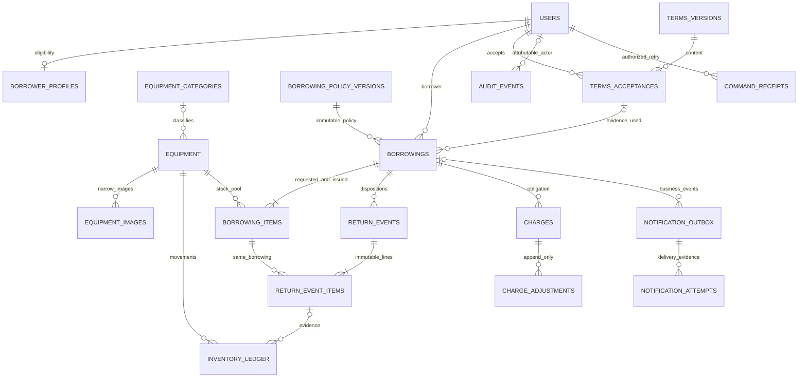

# Phase 2 relational data design

Design review draft, 2026-10-08. **BLOCKED FOR IMPLEMENTATION**: [policy choices](BUSINESS_RULES.md#policy-decision-matrix) can alter states, due columns, acceptance uniqueness, valuation/assessment timing and receipt tables. No SQL migration file is created. Tables below are candidates, not existing product tables. Column lists are important design fields, not executable DDL or a complete migration specification.

## Existing foundation and candidate count

Current source contains **three existing tables**: `users`, `refresh_tokens`, and runner-owned `schema_migrations`. The first three immutable SQL pairs and Phase 1H role/migration operation stay unchanged. Existing auth identity uses provisional `user|admin`, not approved institutional roles. No generic role/permission catalogs are added while OPEN-003 is unresolved.

**25 new table candidates evaluated:** **16 core proposals**, **2 conditional catalog additions**, **3 deferred migration/provenance candidates**, **2 conditional financial-receipt candidates**, **2 conditional kiosk candidates**. Including the three existing tables, inventory below has **28 entries**. This is an evaluation count, not a commitment to implement 28 tables. No report/history-copy/general-settings/organization/serialized-unit table is proposed.

| Class | Tables |
|---|---|
| Existing (3) | users, refresh_tokens, schema_migrations |
| Core proposal (16) | borrower_profiles, equipment, inventory_ledger, borrowings, borrowing_items, return_events, return_event_items, borrowing_policy_versions, terms_versions, terms_acceptances, charges, charge_adjustments, notification_outbox, notification_attempts, audit_events, command_receipts |
| Conditional catalog (2) | equipment_categories, equipment_images |
| Deferred migration (3) | legacy_import_batches, legacy_mappings, legacy_reconciliation_issues |
| Conditional receipt branch (2) | payments, payment_allocations |
| Conditional kiosk branch (2) | kiosk_devices, kiosk_handoffs |

All new shapes are **ENGINEERING RECOMMENDATION**, informed by the [boss references](BOSS_REBUILD_REFERENCE.md), [V1 shape](V1_COMPATIBILITY.md) and accepted constraints/history direction. Conditional/deferred tables must be omitted unless their scope and precise schema are approved before their dependent phase. Existing auth/session tables are not redesigned to match boss.

## Type and integrity conventions

New entity keys are UUID, generated server-side; FK columns share that type. Except stated nullable fields, required integrity/evidence fields are NOT NULL. Quantities use bounded integers; bucket/cumulative/movement sum arithmetic is widened to bigint before checks and checked for overflow in Go. Money is bigint minor units plus explicit currency, never floating-point. All actual event instants use `timestamptz` and UTC exchange; business timezone is an explicit immutable policy value. No database defaults silently invent PHP, Asia/Manila, seven days, rate or consent. Reasons/notes/text have bounded validated lengths; evidence JSON uses a small approved field set, not full request bodies.

All consequential entity/actor refs use RESTRICT/NO ACTION on deletion, not cascade. Exact constraint names come with later migrations. Stable state/movement/adjustment-kind enums are CHECK-constrained after stakeholder selection; open taxonomy is not forced into a guessed CHECK. PK/UNIQUE supply their own indexes; FK query paths receive separate indexes where needed. These PostgreSQL mechanisms and the limit on cross-row CHECK enforcement are documented by [PostgreSQL constraints](https://www.postgresql.org/docs/current/ddl-constraints.html).

## Existing tables (source evidence)

| Table / purpose | Keys, fields, constraints / access, history |
|---|---|
| users — stable login identity | Existing UUID PK; citext UNIQUE email; name/password; provisional role CHECK `user,admin`; is_active; created/updated timestamps. Existing created_at index. New borrower/custody/actor FKs would restrict user deletion; deactivate and preserve stable references. No existing migration rewrite or institution-role acceptance. |
| refresh_tokens — hash-only single-use sessions | Existing UUID PK; UNIQUE token_hash with hex-format CHECK; user FK currently ON DELETE CASCADE; expires/created/updated/revoked instants; self replaced_by FK SET NULL and coherent replacement/revocation checks; live user/terminal/replacement indexes. Existing runtime auth/cleanup contract remains; no business evidence stored here. |
| schema_migrations — migration provenance | Existing canonical version PK, applied_at and checksum under Phase 1H runner; operator-owned, runtime has no access. Not a domain table or generic import ledger. Applied files immutable; SQL/bookkeeping commits atomically under native advisory exclusion. |

## Catalog and eligibility

| Table / purpose | PK, important columns and FKs | UNIQUE / CHECK and indexes | Mutability / retention |
|---|---|---|---|
| borrower_profiles (core) — eligibility independent of login | user_id PK/FK users; nullable institutional_id; approved category; eligibility_state/reason; verified_by nullable FK users with verified_at; version; created_at/updated_at | Institutional-ID uniqueness only if approved (OPEN-002); category/state allowed values after confirmation; verifier/time pair coherent; version>0. Index eligibility_state/user_id for approved directory filtering | Current profile mutable by approved narrow versioned commands; audit every eligibility/status change. Retain for custody/history; contact/course only if required; no copied credentials or samples |
| equipment_categories (conditional) — approved taxonomy | id PK; name; normalized_name; inactive_at nullable; created/updated instants | UNIQUE normalized_name if names must be distinct; nonempty bounded names. Equipment FK lookup/index supplies filtering | Rename/inactivate with audit; referenced category retained, unused erroneous draft may be deleted; category names frozen in issue snapshots |
| equipment (core) — catalog pool and current stock | id PK; optional agreed human code; name/description/aggregate_condition_note; category_id nullable FK categories if adopted; lifecycle; value_minor/currency; available/reserved/checked_out/damaged/lost/retired/total quantities; metadata_version; stock_sequence; archived_at nullable; created/updated instants | Nonnegative bucket/total/value; total=sum buckets with wide arithmetic; version>0, sequence≥0; lifecycle/archive timestamp consistency; optional code UNIQUE only if required. `(lifecycle,name,id)`, category/lifecycle/id if categories; FK refs and ID lock path; search index only after query measurement | Metadata uses expected version/narrow update; counts only via authorized movements, stock_sequence increment per movement. Archive retains all refs; no normal deletion after consequential history. Condition note describes pool, not each unit |
| equipment_images (conditional) — narrow catalog image metadata, no generic file access | id PK; equipment_id FK; storage_key; verified_media_type; size_bytes; content_hash; uploaded_by FK users; created_at; retired_at nullable | UNIQUE storage_key; positive bounded size; approved image MIME/validated signature; one active primary image per equipment via partial unique if one-image policy adopted. Index equipment_id/created_at | Image bytes immutable; replacement retires old association only after safe new storage success; authorized cleanup after references/retention checks. No private report/borrower document purpose accepted here |

External object upload cannot share a PostgreSQL transaction. Future image upload should stage validated bytes, atomically attach metadata/audit after successful storage, and use bounded orphan cleanup on failure; never delete the old image first. GET authorization uses equipment/catalog purpose, never any UUID in one general file bucket. Return photos/documents, borrower photos and export storage are deferred requirements; narrow return notes/references alone suffice now.

## Inventory movement evidence

| Table / purpose | PK, important columns and FKs | UNIQUE / CHECK and indexes | Mutability / retention |
|---|---|---|---|
| inventory_ledger (core) — explain every count change | id PK; equipment_id FK; sequence; movement_kind; signed available/reserved/checked_out/damaged/lost/retired/total deltas; nullable borrowing_item_id FK and return_event_item_id FK; actor_user_id FK users or explicit system attribution; reason/note; request_id; occurred_at | UNIQUE `(equipment_id,sequence)`; sequence>0; delta_total=sum six deltas; nonzero movement; valid kind/ref shape; source ownership APP + composite references where feasible. Index equipment_id/sequence and borrowing_item/return_event_item refs; event occurrence path | INSERT/SELECT only; no runtime UPDATE/DELETE/TRUNCATE and immutable triggers. Baseline/import movements explicitly labeled; retain ordinary history. No fabricated original movements for V1 |

`equipment` is current authority; ledger is immutable supporting evidence, with required reconciliation. From a documented zero/baseline: for each bucket `current=sum(delta)`; total similarly; sequences must be contiguous from initial movement and match stock_sequence. Imported uncertain stock must first reconcile or remain quarantined; no unexplained adjustment to force agreement. Return/event and manual correction reference original evidence so effects are traceable.

Movement vectors below use `(A,R,C,D,L,T; total)` for available, reserved, checked_out, damaged, lost, retired. All entries are **ENGINEERING RECOMMENDATION**, policy-specific disposition guards OPEN-022. `q>0` and source capacity checked under lock.

| Movement | Vector / event reference |
|---|---|
| Initial stock / acquisition | `(+q,0,0,0,0,0;+q)` or explicit reconciled baseline vector; reason/actor |
| Stock removal from available | `(-q,0,0,0,0,0;-q)`; approved removal reason |
| Reservation | `(-q,+q,0,0,0,0;0)`; borrowing item |
| Reservation release | `(+q,-q,0,0,0,0;0)`; denied/cancelled item |
| Held checkout | `(0,-q,+q,0,0,0;0)`; issued item |
| Direct/unheld checkout | `(-q,0,+q,0,0,0;0)`; issued item |
| Return good g, damage d, loss l | `(+g,0,-(g+d+l),+d,+l,0;0)`; immutable return event item; one map/vector used everywhere |
| Repair/restock | `(+q,0,0,-q,0,0;0)`; documented approved repair/inspection reason |
| Retirement from available/damaged | `(-q,0,0,0,0,+q;0)` / `(0,0,0,-q,0,+q;0)` |
| Lost recovery | `(+q,0,0,0,-q,0;0)` or destination damaged after inspection; old loss event/charge not rewritten |
| Disposal / write-off | Subtract lost/retired source and total by q, only after approved policy/evidence |
| Stocktake correction | Approved signed non-custody buckets and matching total delta; never ordinary reserved/checked_out edits; reason and discrepancy reference |

Cross-entity counts must additionally satisfy `reserved=sum(item.reserved)`; `checked_out=sum(item.outstanding)`; `item.good/damaged/lost=sum(return_event_item dispositions)`; event delta equals its corresponding movement; damaged/lost/retired agree with their full movement history after later repair/recovery/disposal. Application transaction checks changed aggregates and deltas; later bounded full reconciliation compares all streams in a consistent database snapshot. A discrepancy must produce a reviewed incident/correction, not silent counter replacement. No giant CHECK queries another table.

## Canonical borrowing and immutable returns

| Table / purpose | PK, important columns and FKs | UNIQUE / CHECK and indexes | Mutability / retention |
|---|---|---|---|
| borrowings (core) — one canonical transaction | id PK; reference; borrower_id FK users; source_channel; state; request_borrower_display/ID snapshot; issue_borrower_display/ID snapshot; requested_policy/terms refs, effective_policy/terms refs FKs; acceptance_id nullable FK terms_acceptances; requested_due input and agreed due_at/timezone; submitted/approved/denied/cancelled/checked_out/completed instants; respective actor FKs; decision_reason; version; created/updated instants | UNIQUE reference and `(id,borrower_id)` for financial ownership FKs; approved stable-state CHECK; timestamp/source coherence after OPEN-021/015; version>0; issued evidence present for custody states. Index `(borrower_id,created_at DESC,id)`, `(state,due_at,id)` for active/reminder queries, `(created_at,id)` staff list | Controlled state/timestamps mutable through legal commands; identity/reference/request snapshots frozen after submission; issue evidence frozen at checkout. Terminal row retained; no copied records table |
| borrowing_items (core) — quantities and snapshots per pool | id PK; borrowing_id FK; equipment_id FK; requested_qty; reserved_qty; issued_qty; good_returned_qty/damaged_qty/lost_qty; outstanding_qty derived/generated `issued-good-damage-loss`; request name/category/value/currency snapshot; issue name/category/value/currency snapshot | UNIQUE `(borrowing_id,equipment_id)` and `(id,borrowing_id)`; requested>0; others≥0; dispositions≤issued; reserved≤requested; issued≤requested (APP initial all-issued rule); reserved and issued cannot coexist on a line; snapshot monetary checks; issue value/currency coherent. Index `(equipment_id,borrowing_id)` for reconciliation, borrowing lookup covered by unique | Current reserved/issued/cumulative totals change only in canonical tx; requested and request snapshots freeze on submit; issue snapshot/issued qty freeze at issue. Item remains after closure |
| return_events (core) — immutable disposition header | id PK; borrowing_id FK; processed_by FK users; processed_at authoritative instant; note; request_id; optional reported_occurred_at only with approved backdate evidence | UNIQUE `(id,borrowing_id)`; bounded notes; processed actor/time required. Index `(borrowing_id,processed_at,id)` | Append-only; no edit/delete. No fabricated earlier return times or general backdating policy; all events retained |
| return_event_items (core) — exactly one disposition line per event/item | id PK; return_event_id; borrowing_item_id; borrowing_id ownership join; good_qty/damaged_qty/lost_qty; note; optional narrowly classified evidence reference only if later approved | UNIQUE `(return_event_id,borrowing_item_id)` and `(id,borrowing_id)`; composite FK `(event_id,borrowing_id)`→return_events and `(item_id,borrowing_id)`→borrowing_items; components≥0, sum>0; proposed CHECK notes nonempty for damage/loss after approval. Index borrowing_item_id/event_id; unique already covers event lookup | INSERT/SELECT only plus immutable triggers; no cascade-delete. Explicit borrowing_id is integrity join, not a second borrower/custody truth |

Same-borrowing composite FKs design out boss's unrelated-event/item relation as well as duplicate stored lines. Database local arithmetic does not alone verify event cumulative totals against issued quantities; the borrowing lock and one normalized application input remain required. Empty aggregate/event is rejected by application before commit; no assertion that a foreign key guarantees at least one child.

The borrowing acceptance FK is inserted/updated in the submission/issue transaction after an acceptance exists; per-borrowing acceptance can reference the already-created uncommitted borrowing. Final constraint ordering/nullable preissue fields depend on OPEN-016. Do not create a guessed once-per-account UNIQUE and then call it per-loan consent.

## Published policies and terms

| Table / purpose | PK, important columns and FKs | UNIQUE / CHECK and indexes | Mutability / retention |
|---|---|---|---|
| borrowing_policy_versions (core) — immutable typed governing rule | id PK; version; effective_from; published_at; published_by FK users; business_timezone; proposed due_mode/cutoff_local_time/max_duration_days and reservation_timing; currency_code/overdue_daily_minor/grace_days/overdue_cap_minor; damage_value_rule/loss_value_rule/value_binding_stage/assessment_timing; source/reference/hash (only approved typed fields retained in final schema) | UNIQUE version and effective_from for single FSMO series; bounded positive duration/nonnegative monetary fields if present; approved enum/field dependencies. Index effective_from DESC; no unspecified defaults | Published rows immutable; later new version, not UPDATE. Selection at request/issue OPEN-023; only fields required by confirmed policy are migrated. No generic arbitrary settings/CMS |
| terms_versions (core) — governing content evidence | id PK; version; content; content_hash; published/effective instants; published_by FK users; source reference | UNIQUE version; content nonempty; valid content hash; bounded text. Index effective_from DESC | Published referenced content immutable; original approved text only, no generated legal wording. Draft editing/publication UI deferred |
| terms_acceptances (core) — attributable acceptance evidence | id PK; user_id FK users; terms_version_id FK; accepted_at; explicit context (`account` or `borrowing`, only approved mode); borrowing_id nullable FK; channel; attributed_by nullable FK users for approved assistance; request_id | Context/borrowing ref coherence; UNIQUE user/version for account-mode partial subset, or UNIQUE borrowing/version for per-borrowing subset, only if that mode approved. `(id,user_id,terms_version_id)` UNIQUE for optional composite link from borrowing; index user_id/accepted_at | Immutable evidence; no fabricated acceptance from old boolean; assisted attribution only if authorized. No unnecessary IP/user-agent fingerprint collection |

Due_date versus instant and activation/acceptance constraints must be finalized after policy confirmation. The optional alternatives above expose required changes; they are not a configuration engine for arbitrary live modes. A single FSMO policy series suffices, with immutable references for old transactions. No organization FK or per-lab rule lookup exists.

## Authoritative accountability

| Table / purpose | PK, important columns and FKs | UNIQUE / CHECK and indexes | Mutability / retention |
|---|---|---|---|
| charges (core) — immutable assessment, sole base truth | id PK; borrower_id FK users; borrowing_id; nullable item_id/return_event_id/source_event_item_id; source_kind; source_key; assessment_window_start/end if overdue; amount_minor; currency; policy_version_id FK; basis_snapshot with approved units/rate/day/value; assessed_at; user/system actor attribution | UNIQUE source_key including borrowing/item/window/event/component; amount>0 (zero needs no assessment row); valid currency/kind; composite `(borrowing_id,borrower_id)` FK→borrowings and item/event ownership FKs as applicable; required source shapes; `(id,borrower_id)` unique if receipt branch. Index borrower/assessed_at/id, borrowing_id, source refs | Append-only base including amount/currency/basis/refs; no mutable status/finePaid/outstanding columns. Manual unlinked assessment deferred unless required. Retain independently of custody closure |
| charge_adjustments (core) — immutable obligation changes | id PK; charge_id FK; kind; amount_minor>0; reason/note; actor FK; occurred_at; reverses_adjustment_id nullable self FK; source command identity | UNIQUE `(id,charge_id)` supports composite same-charge reversal FK; kind CHECK; reversal self reference forbidden; positive reversal targets reduction/waiver/settlement only, not an increase; shape/kind validated; unique source operation where needed; index `(charge_id,occurred_at,id)` and reversal ref | INSERT/SELECT only/immutable triggers. App charge lock prevents negative balance and over-reversal; no cross-row CHECK pretending to do that. No assessment overwrite on waiver/settlement |

Derived `charge_balances` view/read query is **not another table**: base + signed adjustment totals; assessed/increased/reduced/waived/settled/reversed/outstanding fields separately exposed. Zero outstanding closes accountability mathematically, with reason composition; policy determines which subsequent correction/reopening is authorized. Do not persist another status that can contradict zero balance. Each nonpayment adjustment is not a collection. Future payment allocation (if approved) must reference the corresponding settlement adjustment rather than subtracting twice.

## Audit, notifications and command receipts

| Table / purpose | PK, important columns and FKs | UNIQUE / CHECK and indexes | Mutability / retention |
|---|---|---|---|
| audit_events (core) — durable who/what/when evidence | id PK; actor_user_id nullable FK users for explicit system actor; actor_kind/system_action; action; entity_kind/entity_id; occurred_at; bounded reason; meaningful before/after/context JSON; server request_id and command/event ref | Valid actor form/action/entity kind; required entity/action/time; minimal JSON shape in APP. Entity ref is typed/polymorphic evidence: APP verifies actual entity; user FK enforced. Index entity_kind/entity_id/time/id, actor/time, action/time | Append-only protected by grants/triggers. Not every read or raw request/error; no credentials, tokens, whole profile or provider body. Retention/access OPEN-026, not log rotation |
| notification_outbox (core) — durable business notification intent | id PK; unique event_key; user_id FK; optional borrowing/return/charge refs; channel; template_key/version; minimal event payload; created/available/accepted instants; status; retry_count; lease_token/lease_until | UNIQUE event_key; allowed statuses pending/processing/accepted/dead/cancelled; retry_count≥0; lease coherence; refs owned by recipient checked APP. Index pending available_at/id, lease_until/id, borrower/borrowing refs | Event identity/payload immutable; delivery progress mutable through fenced commands. `accepted_at` means provider acceptance, not proven recipient delivery. Attempt/event retention requires policy; no in-app inbox by inference |
| notification_attempts (core) — immutable delivery evidence | id PK; outbox_id FK; attempt_no; lease_token; attempted_at; provider; outcome; safe error_class; nullable provider_message_id | UNIQUE `(outbox_id,attempt_no)`; attempt>0; finite safe outcome enum; lease token required. Index outbox/time (unique covers lookup), outcome/time if operational use | Append-only; no arbitrary SMTP/body/error text or secret addresses copied to logs. Failure/success state and attempt append commit together after provider action; no exactly-once delivery claim |
| command_receipts (core) — retry outcome for selected commands | id PK; actor_id FK users; operation; resource_context (explicit concrete resource/root sentinel); source_channel; key; request_hash; committed entity/event refs/result_status; created_at; expires_at nullable only after approved retry-retention policy | UNIQUE `(actor_id,operation,resource_context,source_channel,key)` with NOT NULL context; hash format; valid finite result status; bounded key. Index actor/created_at and expiry if used | Claim and completed outcome share the business tx; unfinished claim cannot commit. Payload fingerprint excludes credentials, includes target/resource/channel/input. Result stores minimal private reference/command outcome, not full token/profile data; replay reauthorizes. Retain unique key/hash/entity binding while its business effect exists; any approved response-data expiry preserves that compact identity so retry cannot recreate the effect |

Outbox event key examples: `borrow:<id>:submitted`, `borrow:<id>:decision:<audit-event-id>`, `return:<return-event-id>:recorded`, `charge:<id>:assessed`; reminder key includes borrowing ID, type, effective policy version and approved local schedule window. Repeated partial returns necessarily have different event IDs. Provider failures preserve committed business state. Future worker claims bounded batches with native row locks/SKIP LOCKED and finite leases; completion UPDATE requires matching lease token, not merely row ID. Preserve persistence errors and alert/retry them rather than swallowing them. Retry cadence/provider/worker deployment is later Phase 9 work, not implemented SMTP now.

Idempotency is proposed for submit/direct checkout/returns and selected assessment/adjustment/disposition commands where acknowledgment loss risks duplication. Approve/deny/checkout still enforce locked state transitions; choose receipts when offline retry/ack recovery is required. Ordinary metadata update uses expected version, not blanket idempotency. Context includes actor, operation, concrete borrowing/resource, channel, target borrower and normalized payload fingerprint; same key/different payload conflicts. Reauthentication/resource authorization precedes exposing any replay. A successful repeated command returns the original event/entity identity and does not add stock/history/notification effects. The current response's requestId is generated fresh; it is never replayed as the original HTTP correlation ID.

## Deferred and conditional candidates

These seven candidates are **evaluated only**, omitted from core migrations until approved need and detailed constraints are reviewed. They do not authorize payments, kiosk auth or a legacy importer now.

| Table / condition and purpose | PK / important columns / FKs | UNIQUE / CHECK / indexes | Mutability / history |
|---|---|---|---|
| legacy_import_batches — deferred Phase 12, export provenance | id PK; legacy_system; export_manifest_hash; source_revision/exported_at nullable when unknown; authorized operator FK users; created_at; reconciliation/status summary | UNIQUE system/manifest only if batch replay semantics approved; valid hash/status; index system/created_at | Source evidence immutable; bounded progress/status mutable, reconciliation artifacts protected. Never invent missing export/event time |
| legacy_mappings — deferred Phase 12, source→target lineage | id PK; batch_id FK; legacy_system/collection/document_id/source_path; source_hash; target_kind/target_id; transformation/reconciliation decision ref | UNIQUE system/collection/doc/path/target_kind for explicit one-to-many line mapping; hashes/allowed target kinds; indexes batch and target_kind/target_id. Polymorphic target ref has APP existence validation; later typed-FK design preferred if adapter scope permits | Immutable committed mapping claimed atomically with its target, never first in independent tx; same-source/different-hash conflict is reviewed, not silently skipped |
| legacy_reconciliation_issues — deferred Phase 12, retain uncertain evidence | id PK; batch_id FK; mapping_id nullable FK; issue_kind; source ref/hash; resolution actor FK/time/decision; restricted evidence pointer | Nonempty issue/source; resolution actor/time coherent; index batch/kind/created_at | Preserve original issue/evidence; append/referenced resolution record preferable to overwriting evidence. No guessed history/payment/stock fix |
| payments — conditional OPEN-007, actual approved receipt evidence | id PK; borrower_id FK; amount_minor/currency; received_by FK; received_at; method/reference/receipt evidence; source command | Approved receipt-reference UNIQUE scoped to method; amount>0; supported method CHECK after policy; borrower/time index | Immutable receipt; reversals/refunds require newly approved evidence schema, not editing amount. Excluded if system only records administrative discharge; no provider integration assumed |
| payment_allocations — conditional OPEN-007, no double subtraction | id PK; payment_id FK; charge_id FK; settlement_adjustment_id FK; allocated_minor; borrower identity for composite ownership refs | UNIQUE settlement_adjustment_id; positive allocation; charge/payment same borrower/currency verified with composite FKs where available and APP; indexes payment/charge | Immutable; transaction locks payment and charges in order; sums≤received/balance, reconciliation to settlement adjustment. Refund/reversal policy needs design before enabling |
| kiosk_devices — conditional OPEN-010, narrow device authority | id PK; label; credential_hash if this mechanism approved; provisioned/revoked actor FKs/time; last_seen if justified | UNIQUE hash; valid hash/revocation shape; active-device index | Device credential independent from borrower session; rotation/revocation audited; no business stock truth; raw credential never persisted |
| kiosk_handoffs — conditional OPEN-010, expiring attributed intent | id PK; device_id FK; token/code digest if approved; bounded cart intent; created/expires/consumed instants; consumed_by FK; borrowing_id nullable FK | UNIQUE digest; expiry>created; coherent consumed actor/time/link; index expires_at and device | Intent does not reserve/issue merely by creation; consume once within same canonical borrowing tx after borrower/operator verification. Expired/private intent cleanup has approved retention; code is not borrower identity |

No generic `settings` table is justified: typed immutable FSMO borrowing policies and terms cover identified needs. No reporting table/materialization is justified without measured performance. Private export artifacts, return attachments, maintenance jobs, role catalogs and transaction history copies are not silently added to the candidate count.

## Core relationship diagram

Diagram includes proposed/conditional catalog entities, omits auth/infrastructure and deferred payments/kiosk/import candidates for readability. All many-side borrowing/financial/evidence deletion refs are restrictive.

Issue policy/terms refs are nullable preissue and required at issue; request policy refs are recorded separately if binding differs. Mermaid lines do not enforce nonempty children or optional-reference lifecycle conditions; those guards are explicitly in the catalog/invariants.

## Transactions and lock order

**ENGINEERING RECOMMENDATION:** READ COMMITTED with explicit row locks and conditional writes, compatible with current inward `application.TransactionRunner` and `database.TxManager`. Do not use an application-only mutex. Native row locks block competing updates until transaction end; deterministic acquisition order reduces deadlock risk ([PostgreSQL explicit locking](https://www.postgresql.org/docs/current/explicit-locking.html)).

Shared ordering for every future participating writer:

1. Validate/authenticate input and identify actor/target/resource without trusting it for authority. Claim selected command receipt uniqueness inside the tx; a competing same-key claim waits/replays after checking hash/current access. All replay paths reauthorize without acquiring later locks and then returning to earlier ones.
2. Lock all required User rows by UUID ascending; use SHARE for authority reads and UPDATE for actual account writes, selecting strongest needed mode in advance. Then lock matching BorrowerProfile rows in the same ordered IDs. Rebuild current actor/target eligibility/operation checks inside the tx. Account/status/role/profile writers must honor this same protocol.
3. Lock existing Borrowing header(s) by UUID ascending before reading/modifying items. New submit/direct has no existing header to acquire; create canonical header/items in its tx. A return always locks its one owning header.
4. Lock every affected Equipment pool by UUID ascending once, deduplicating IDs before locking. All reservation/custody/manual/catalog writers honor it. Read current counts/status and authoritative item cross-sums **after** obtaining the lock. Snapshot/value metadata changes honor the same equipment lock/version discipline.
5. Lock affected Charge rows by UUID ascending; payment parent precedes charge rows if the conditional receipt branch is later adopted. Compute current adjustment balance under the charge lock. Do not acquire equipment/borrowing locks after charge locks.
6. Apply validated domain transitions; write equipment/item counters, immutable movements/events/assessments/adjustments/audit/outbox and completed command receipt in the **same transaction**. Verify changed-row arithmetic/cross-reconciled deltas; rollback on any failure, including required evidence insertion. Commit before returning success.

Standalone stock adjustment/archive locks users then equipment and never subsequently locks borrowing rows. To check custody/holds it reads item aggregates under the equipment guard; all item reservation/custody writers must acquire that equipment lock before mutation. This prevents an equipment→borrowing versus borrowing→equipment cycle. Standalone charge adjustment locks users then charge, never later borrowing/equipment. Standalone account edit locks users/profiles and does not acquire them in reverse order. Notification claims live in separate worker transactions; they never hold leases while locking business resources or calling SMTP inside a business transaction.

| Operation | Locks / condition / atomic writes |
|---|---|
| Submit/reserve | Actor/borrower/profile, selected equipment sorted; verify approved due/terms/category/stock; A reserves, B no hold; header/items/acceptance/movements/audit/outbox/receipt |
| Approval | Actor/target/profile, borrowing, equipment sorted; pending and fresh eligibility/catalog/due; B reserves, A holds; decision evidence/outbox; combined issue only if approved |
| Denial/cancellation | Actor and resource owner locks as needed, borrowing, equipment; legal actor/state; release exact held quantity, not requested/previously issued quantity; preserve terminal evidence |
| Checkout/direct | Actor/target/profile, existing borrowing when applicable, equipment; new stock/eligibility/deadline/consent check; consume hold or availability once; frozen issue evidence/ledger/audit/outbox/receipt |
| Stock adjustment/archive/metadata | Actor then equipment; fresh counts, non-custody movement or archive guard; metadata expected version; ledger/audit if quantity, no direct count patch |
| Partial/final return | Actor, borrowing, equipment, any existing related charges if adjustment needed; unique normalized lines, ownership/outstanding; all custody/stock/event/evidence writes; approved final/new assessment source keys |
| Charge adjustment | Actor then charge; authoritative balance/source/currency/reason, conditional positive adjustment; immutable append/audit/outbox/receipt; no base UPDATE |

Deadlocks/serialization failure may receive a bounded whole-transaction retry only when command identity and effects are safe; no unbounded retry or partial continuation. Lost commit acknowledgment is unknown outcome, recovered with the original command key/receipt rather than blindly issuing again. Conflict details expose only authorized resources. Real two-connection tests must verify last stock, same approval/issue, different/same-key returns, actor inactivation, metadata/archive race, charge over-discharge and fault rollback.

## Immutability, constraints and indexes

Future runtime role receives only named-object rights per DEC-043. Evidence tables (movements, return events/items, published policies/terms/acceptances, base charges, adjustments, audit, notification attempts) get SELECT/INSERT as needed and UPDATE/DELETE/TRUNCATE-denial triggers. Canonical borrowing terminal/snapshot columns require immutability guards and narrow update statements. Current-row quantity updates remain a controlled repository permission, backed by transaction/reconciliation tests; this design does not falsely claim simple grants enforce cross-table sums against an arbitrary compromised writer. Schema owner/exceptional corrections remain controlled operational authority.

Core indexes serve bounded catalog discovery, borrower own history, staff state/deadline queue, equipment item reconciliation, chronological returns/adjustments/movements, pending/expired notification leases and unique command/source claims. Use stable `(time,id)` or `(name,id)` ordering; include owner before paging, never filter afterward. Partial active-custody/deadline indexes can be added against selected stored states, not volatile `now()` predicates. Case-insensitive prefix search suffices initially if confirmed useful; trigram/full-text/materialization needs workload justification later. No duplicate PK/UNIQUE indexes, index-every-column approach, or campus aggregates.

## Deletion, archive and privacy plan

| Record | Ordinary action / hard deletion boundary |
|---|---|
| User / borrower profile | Deactivate/restrict access; stable actor/borrower refs retained; no user hard delete with consequential refs. Existing session cleanup unchanged. Privacy transformation separately approved (OPEN-026) |
| Equipment | Inactivate/archive without holds/custody; retain ID/metadata refs/snapshots/ledger. Only mistaken unused setup with no consequential movement/history could be considered for authorized deletion; never bypass existing history |
| Category / image | Inactivate category/retire image association; unused erroneous category/staged unreferenced bytes can be removed under approved cleanup; snapshots/history retained |
| Borrowing / items | Retain all terminal decisions/completion; no normal hard/soft delete and no history-copy table |
| Returns / movements / assessments / adjustments / audit / published versions / acceptance | Immutable retained evidence; no normal deletion. Exceptional privacy/retention handling needs approved procedure preserving reconciliation/attribution |
| Notification outbox / attempts | Delivery state changes retain attempts; expiry/purge only under approved retention with minimal linkage preserved; no blanket “soft delete” |
| Command receipt | Retain compact key/hash/entity identity while business effect exists; approved response-data expiry must preserve that binding and cannot recreate an effect. Retry response/detail duration unresolved; no made-up TTL or key reuse after cleanup |
| Deferred migration / payment / kiosk evidence | Retain approved lineage/receipts; expire transient handoff intent/credentials only with approved shared-device/retention rules |

No blanket deleted_at column is attached to every table. Restrictive FKs, protected snapshots and policy-version evidence prevent routine cascading history loss. No capstone PII, secrets, live exports or simulated institution-approved retention periods enter these documents. Down migrations later require review of evidence loss; a DROP TABLE is not a safe rollback after operational data exists. Prefer forward correction/release rollback and separately rehearsed backup/restore, preserving Phase 1H explicit operation.
