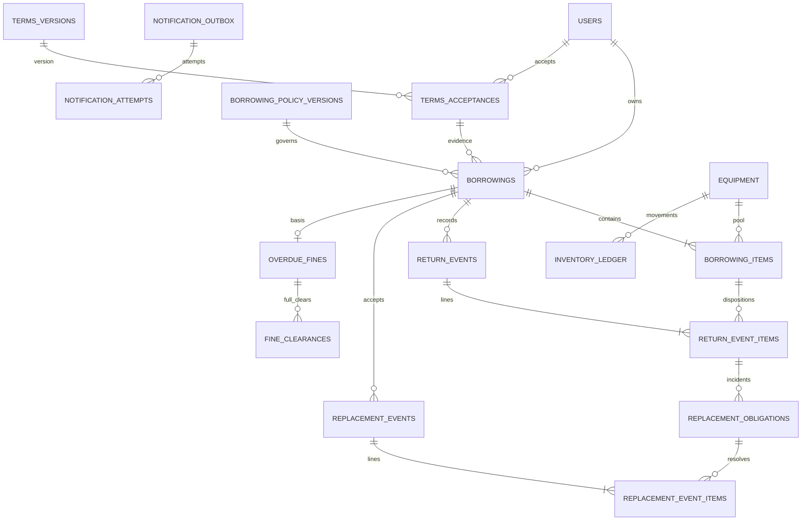

# Phase 2.5 relational design candidates

2026-10-08. **ENGINEERING RECOMMENDATION** for later approved migrations, driven by working owner policy DEC-051–061. No SQL migration, table or runtime permission has been changed. Existing Phase 1H owner/runtime split and paired immutable migrations remain authoritative. Do not copy boss SQL or fabricate table numbering. [Rules](BUSINESS_RULES.md), [stock arithmetic](DOMAIN_MODEL.md#selected-inventory-model-and-alternatives), [transactions](STATE_MACHINES.md#expiry-races-and-atomicity), [invariants](INVARIANTS.md).

## Candidate inventory — 26 table entries

**3 existing tables + 18 new core candidates + 2 conditional catalog candidates + 3 deferred legacy candidates = 26 entries; 23 are new candidates, not deployed tables.** No borrower eligibility/profile, generic charge/payment allocation, or kiosk hardware table.

| # | Table | Status | Purpose / principal columns |
|---|---|---|---|
| 1 | users | EXISTING, future approved extension | Stable ID/name/email/password hash/current generic role/is_active and timestamps remain. Proposed product roles BORROWER/STAFF/ADMIN, nullable borrower_category/program/contact where justified; no category-as-permission |
| 2 | refresh_tokens | EXISTING unchanged | Phase 1 strict rotation/session evidence; no product schema rewrite |
| 3 | schema_migrations | EXISTING unchanged | Phase 1H checksum/history/operator ownership; runtime cannot access |
| 4 | equipment | NEW CORE | ID, metadata, optional category/image FK, lifecycle ACTIVE/INACTIVE/ARCHIVED, A/R/C/damaged_held/total_tracked, stock_sequence, metadata_version, timestamps |
| 5 | inventory_ledger | NEW CORE | ID, equipment, sequence, movement_kind, signed A/R/C/D/total deltas, source_type/id/line, actor/system actor, reason, occurred_at |
| 6 | borrowings | NEW CORE | ID, unique reference, borrower FK, entry_path, lifecycle, submitted/expires/decision/checked_out/completed/terminal times, requested_due_at, issued due_at, policy/acceptance FK, immutable borrower snapshot, visible denial reason |
| 7 | borrowing_items | NEW CORE | ID, borrowing/equipment FKs, requested/reserved/issued/good/damaged/lost quantities, request/issue metadata snapshots; physical outstanding generated or computed |
| 8 | return_events | NEW CORE | ID, borrowing FK, operator, occurred_at, notes, correlation/command reference; immutable header |
| 9 | return_event_items | NEW CORE | ID, event/borrowing/item FKs, good/damaged/lost, incident rationale; immutable dispositions |
| 10 | replacement_obligations | NEW CORE | ID, borrowing/item/source return-line FKs, kind DAMAGE/LOSS, required_qty, created_at; immutable basis, no second stored accepted/balance truth |
| 11 | replacement_events | NEW CORE | ID, borrowing FK, Staff/Admin operator, accepted_at, notes; immutable acceptance header |
| 12 | replacement_event_items | NEW CORE | ID, event/borrowing/obligation FKs, accepted_qty, equipment destination, accepted-type/equivalence evidence; immutable acquisition/acceptance line |
| 13 | borrowing_policy_versions | NEW CORE | Immutable published typed version: pending_ttl_seconds86400, zone Asia/Manila, currency PHP, daily_fine_minor1000, day_seconds86400, rounding CEILING_ELAPSED_24H, nullable max_duration_seconds, effective_from/publisher |
| 14 | terms_versions | NEW CORE | Immutable published version, approved text/hash, effective_from, material-change marker, publisher/time |
| 15 | terms_acceptances | NEW CORE | ID, user FK, terms_version FK, accepted_at, minimal acceptance evidence |
| 16 | overdue_fines | NEW CORE | ID, borrowing unique FK, immutable due/rate/currency/day/rounding basis, nullable final_amount_minor/final_overdue_days/finalized_at until completion |
| 17 | fine_clearances | NEW CORE | ID, fine FK, cumulative_assessed_minor_at_clear, cleared_amount_minor, cleared_at/by Admin, method PAID/WAIVED/OTHER_RESOLUTION, optional note; immutable full-clear checkpoint |
| 18 | notification_outbox | NEW CORE | ID, unique business event key/type/source/recipient reference, minimal versioned payload, status, available_at/claim_until/claim_token/attempt_count/created_at |
| 19 | notification_attempts | NEW CORE | ID, outbox FK, unique attempt token, started/ended time, bounded sanitized outcome/provider ref; append-only attempt evidence |
| 20 | audit_events | NEW CORE | ID, named actor or explicit system actor, action, entity/source, occurred_at, command/correlation, minimal before/after/reason; immutable business evidence |
| 21 | command_receipts | NEW CORE | ID, actor/operation/resource/key scope, normalized payload hash, result entity/event identity and safe response schema version, committed_at |
| 22 | equipment_categories | CONDITIONAL CATALOG | Confirmed filter capability; names/taxonomy later. ID/name/status; no department hierarchy |
| 23 | equipment_images | CONDITIONAL CATALOG | Equipment-purpose image metadata/storage locator/content type/size/hash, ownership/publication state; approved storage later |
| 24 | legacy_import_batches | DEFERRED LEGACY | Authorized export/batch provenance/hash/revision, reconciliation/signoff status; no live import now |
| 25 | legacy_mappings | DEFERRED LEGACY | Unique batch/source system/collection/document→target identity, mapping decision and provenance |
| 26 | legacy_reconciliation_issues | DEFERRED LEGACY | Source reference, issue kind, original evidence, quarantine/resolution actor/time; never fabricated current stock/identity |

## Relationships

Issue creates exactly one fine basis per issued borrowing even if amount is zero; pending/denied/cancelled/expired have none. ReplacementObligation kind creates at most two obligations per return-line (one damage, one loss), only when that kind's quantity is positive. Historical return-line is the incident; no redundant damage/loss master truth is needed. UI can query unresolved obligations by kind independently of physical quantities.

## Structural constraints and uniqueness

All IDs use current UUID convention; quantities are NOT NULL nonnegative integers with checked overflow at the application boundary. Monetary amounts BIGINT minor units and explicit PHP; timestamps timestamptz; staff interpretation Asia/Manila. No naive date-only due or floating-point charge. Use wide casts in stock/counter CHECK arithmetic to avoid intermediate integer overflow.

| Candidate | Required constraint |
|---|---|
| equipment | Every quantity>=0; `total_tracked=A+R+C+damaged_held`; enum lifecycle; positive versions/sequences as appropriate |
| inventory_ledger | UNIQUE(equipment_id,sequence); `delta_total=sum(bucket_deltas)`; typed source/movement; unique source-line/movement/pool effect; per-equipment source composite FK where feasible |
| borrowings | Unique reference; valid lifecycle/entry path; borrower/policy/acceptance FKs RESTRICT; issue/due presence iff issued; completion timestamp iff completed; pending has submission/expiry; denial requires trimmed reason; terminal timestamp consistency |
| borrowing_items | UNIQUE(borrowing_id,equipment_id); UNIQUE(id,borrowing_id), plus equipment-scoped composite target as needed; requested>0; reserved/issued bounds; `good+damaged+lost<=issued`; generated physical>=0 |
| return_events / lines | UNIQUE(event_id,item_id); event+borrowing composite FK, item+borrowing composite FK; components>=0, sum>0; header nonempty enforced by aggregate transaction |
| replacement_obligations | UNIQUE(source_return_line_id,kind); required_qty>0; source return-line/item/borrowing composite ownership; required equals that source kind's quantity (transaction invariant); immutable |
| replacement_events / lines | UNIQUE(event_id,obligation_id); event+borrowing and obligation+borrowing composite FKs; accepted_qty>0; destination pool equals source item's pool under selected equivalence rule; nonempty header aggregate |
| terms_acceptances | UNIQUE(user_id,terms_version_id), UNIQUE(id,user_id); borrowing `(acceptance_id,borrower_id)` composite FK ensures evidence owner |
| policy/terms versions | Unique immutable published version/effective boundary; nonoverlapping active selection by latest effective published version; publication/current selection serialized through singleton FSMO advisory lock/port, not organization table |
| overdue_fines | UNIQUE(borrowing_id); currency/rate/day/rounding basis valid; final amount/days/time all-null or all-present; final nonnegative and internally formula-consistent; once-only finalization |
| fine_clearances | cleared_amount>0; assessed checkpoint>=cleared_amount; method enum; actor/time required; full current-balance equality and Admin authority are transaction invariants, not cross-row CHECK |
| outbox / attempts | UNIQUE(event_key); UNIQUE(outbox_id,attempt_token); typed bounded sanitized payload; claim completion token fenced |
| command_receipts | UNIQUE(actor_id,operation,resource_scope,idempotency_key); scope represents concrete aggregate or stable command target, never nullable ambiguous uniqueness; payload hash immutable |

Cross-row sums, lifecycle membership, nonempty aggregates, Admin-at-command-time authority, acceptance<=remaining and fine clearance<=derived balance cannot be enforced by a simple row CHECK. Application transactions/locks plus real DB reconciliation tests are mandatory. Composite parent ownership requires corresponding explicit composite UNIQUE targets, not just separate single-column FKs. Parameterize all SQL; allowed sort/filter identifiers are allowlisted.

## Transaction integrity and snapshot timing

One inward transaction port supplies all participating repositories, audit, outbox and receipt stores. Lock order is users sorted → policy/terms publication lock when needed → borrowings sorted → obligations sorted → equipment sorted → fine row → evidence/receipt. Inventory-only writers start at participating users/equipment; never acquire borrowing after equipment. Same-key receipt lookup can be preliminary, but conflicting receipt claims must not reverse lock order. New submit/direct flows serialize target/account, policy selection and equipment then create their new aggregates. Concurrent commands for the same existing borrowing serialize before stock arithmetic.

Submission binds current terms acceptance and policy (including 24h TTL) and request snapshots. Approval checks active target/current equipment under locks, confirms required future due date/time and captures immutable issue snapshots. Terms publication does not reopen submission acceptance; direct issue checks current acceptance. Same-day date choice must convert to an unambiguous Asia/Manila absolute instant, not browser timezone guessing. Policy publication should take account then publication boundary as applicable; publication alone never waits on a user it did not initially lock.

Returns update cumulative disposition counters from one normalized map, insert immutable lines, create obligations exactly equal to damage/loss, apply exact inventory vectors and ledger. Replacement accepts compute remaining from immutable events under obligation/borrowing lock; acceptance is a new usable acquisition. Multiple obligations in the same pool use summed acquisition for stock and source-specific evidence consistent with that sum. Completion checks both physical and replacement totals and freezes the fine with audit/outbox/receipt atomically. Failed required evidence leaves no stock/header/counters.

Fine clear locks borrowing/fine, computes cumulative assessed at captured command time or immutable final, subtracts prior full clearances, verifies positive whole outstanding and expected balance, inserts one full-clear event. On a live loan later accrual is a new outstanding delta; no daily writable assessment or payment allocation table. Fine current/final amount, cleared total and remaining balance are projections over this single basis. Immutable final fields have an exceptional once-only NULL→final transition protected by narrow update/DB guard; subsequent updates/deletes forbidden.

Idempotency is actor/operation/resource/key plus canonical input hash covering target/unique quantities/due/version/clear method/equivalence evidence as relevant. Actors/prices/state/clear amount are not trusted client values. Same-key/same-input receipt replays original committed identity after current authorization; same-key/different-input conflicts. Successful receipt participates in the business commit; acknowledgment loss is unknown until original-key lookup. Bounded payload/result data must not store credentials. Expiry uses unique aggregate terminal effect and system identity; it never masquerades as named Admin.

## Index and bounded query strategy

| Read / work | Candidate index |
|---|---|
| Catalog active search/order | Lifecycle plus stable name/ID; category/status as used; bounded parameterized search, no speculative search service |
| User own / operational borrowing history | `(borrower_id,created_at DESC,id)`; lifecycle/created_at; explicit ownership before count/page |
| Pending expiry | Partial `(expires_at,id)` WHERE lifecycle=PENDING; bounded skip-locked work compatible with lock order |
| Open due/overdue | Partial `(due_at,id)` WHERE lifecycle=CHECKED_OUT; unresolved checks include replacement |
| Return history/counters | `(borrowing_id,occurred_at,id)` and `(item_id,event_id)` |
| Replacement remaining / destination | `(borrowing_id,item_id,kind)` obligations; `(obligation_id,event_id)` acceptance lines; equipment join indexed |
| Stock ledger / reconciliation | Unique equipment/sequence; source identity; timestamp/ID for authorized movement history |
| Fine balance / clear history | Unique borrowing fine; `(fine_id,cleared_at,id)` |
| Active policy/terms | `(effective_from DESC,id)` published selector plus version uniqueness |
| Outbox work / attempts | Partial ready/available_at/ID; claim_until; outbox/attempt token |
| Audit | Entity/action/time/ID, actor/time/ID for permitted queries |

Query bounds are engineering transport limits, not borrower quotas. Prefer default20/max100, stable ordering and half-open report ranges; measure before adding text-search indexes/export jobs. Overdue formula is shared rather than duplicated with different SQL calendar semantics. Pending expiry sweep and fine projections do not require daily fine mutation. Final report definitions separate recorded PAID from waiver/other and assessed amount.

## Immutability, archive and retention

Canonical borrowings/items may update only legal live state/counters; issue snapshots and terminal evidence freeze. Return/replacement events, obligation basis, ledger, clearances, published versions and business audit are append-only. Runtime evidence tables receive SELECT/INSERT only plus defensive immutable guards; narrow repository/trigger contracts permit only required current-state and fine-finalization writes. Do not rely solely on Go convention with blanket runtime UPDATE/DELETE on immutable evidence.

FKs to consequential history RESTRICT deletion. Account deactivation retains history; equipment archive cannot proceed with reserved, physical or replacement quantities outstanding. Inactive equipment may resolve old loans. Metadata CRUD never overwrites stock, old values or borrowed identity snapshots. Ordinary adjustments do not alter held/custody counts or fabricate disposition; exceptional Admin correction must reconcile evidence, not conceal it. Physical damage originals remain nonusable until authorized later policy disposition; incident survives even if original removed or replacement complete.

Legal/institutional retention and anonymization/export obligations remain NON-BLOCKING design questions but gate destructive cleanup. No infinite retention claim, cascade-erasure, generic file endpoint or private capstone PII. Retention must distinguish consequential event evidence, minimal account/profile display, operational logs, delivery payload and idempotency replay data.

## Removed and deferred candidates

Removed `borrower_profiles` / independent eligibility status: active User and category suffice. Replaced `charges`/`charge_adjustments` with focused `overdue_fines`/`fine_clearances`. Removed conditional payments/payment_allocations and any receipt/refund gateway model: PAID clearance is the confirmed offline operational record. Removed kiosk_devices/kiosk_handoffs/device credentials/sessions entirely from active design: no independent requirement remains. Damage/loss monetary price snapshot components and lost/retired current-stock buckets are removed, not carried as hidden defaults.

Categories/images remain conditional catalog implementation/storage details. Three legacy provenance candidates remain deferred to Phase 12 authorized discovery/cutover. Return photographs are entirely outside eLabTrack: a borrower may physically show a personally stored phone photo during the face-to-face interaction, and Staff/Admin alone records authoritative condition/quantities. No return-photo acceptance, upload, transmission, storage, retention, attachment, file model, table candidate or evidence-upload workflow is in scope. Structured return events/notes/audit are business records, not photographic evidence. Damaged-original repair/disposal workflows remain nonmandatory later inventory work; equipment catalog image candidates are preserved. Production grants and final SQL/types/indexes must be verified in the later approved migrations with the real Phase 1H roles.
