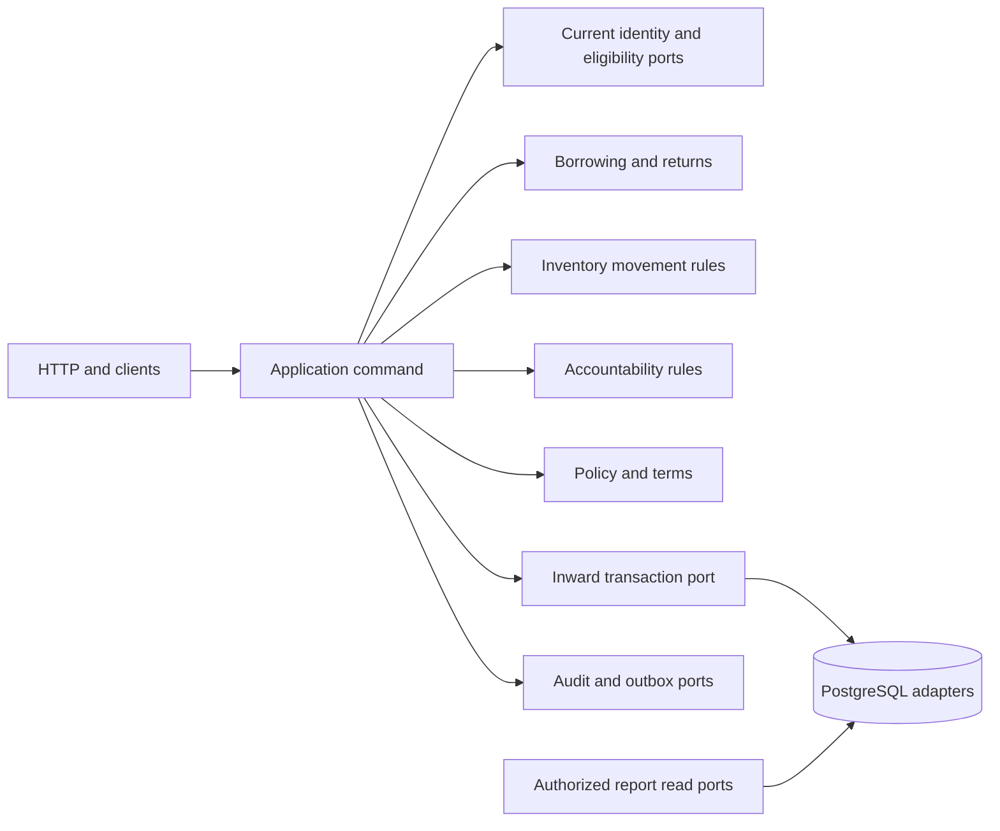

# Phase 2 domain model

Design review draft, 2026-10-08 (Asia/Shanghai). **BLOCKED FOR IMPLEMENTATION** pending the [policy gate](BUSINESS_RULES.md#policy-decision-matrix). These are proposed business entities; only the Phase 1 users/session/migration infrastructure exists. No business migrations, services or screens are implemented.

## Authority and reading map

Authority is current stakeholder/Dean direction → current V2 decisions → capstone intent → audited V1 behavior → boss design reference → engineering recommendation. Current source establishes implementation facts, not institutional policy. The seven labels used throughout this package are:

| Label | Meaning |
|---|---|
| CONFIRMED REQUIREMENT | Express current stakeholder direction; FSMO modernization and this design-only phase |
| CURRENT V2 DECISION | Accepted decision in the [register](../project/DECISIONS.md); implementation may still be future work |
| ACTUAL V1 BEHAVIOR | Static evidence in the [complete V1 audit](../reference/v1-audit/README.md), including its separately recorded undeployed hardening supplement |
| CAPSTONE INTENT | Business/academic intent in the local DOCX; neither live behavior nor automatically accepted V2 policy |
| BOSS DESIGN REFERENCE | Audited/selected read-only boss source; never product authority |
| UNRESOLVED PRODUCT POLICY | Institutional choice requiring accountable stakeholder confirmation |
| ENGINEERING RECOMMENDATION | Reviewable V2 proposal; never silently promoted to accepted institutional policy |

Read [business rules and decisions](BUSINESS_RULES.md), [states and scenarios](STATE_MACHINES.md), [relational design](DATA_MODEL.md), [test-ready invariants](INVARIANTS.md), [V1 compatibility](V1_COMPATIBILITY.md), [boss salvage map](BOSS_REBUILD_REFERENCE.md), and [API draft](API_RESOURCE_DRAFT.md). The [Phase 2 report](../project/PHASE2_REPORT.md) records scope, validation and readiness.

## Scope

**CONFIRMED REQUIREMENT:** eLabTrack V2 modernizes the existing FSMO equipment borrowing transaction and tracing operation. It is not the campus-wide system. No organizations, campus/unit/laboratory hierarchy, cross-department borrowing, global Super Admin, serialized physical assets, RFID/barcode/QR tracking, native mobile or offline synchronization is designed here. Clean boundaries permit later independent adaptation without adding those entities now.

**CURRENT V2 DECISION:** one React/TypeScript/Vite SPA, Go/Fiber v3 API, PostgreSQL/pgx, shadcn/Tailwind v4/Lucide; inward domain/application ports (DEC-001–017). Borrowers are mobile-first, kiosk touch-first, staff/admin desktop/tablet-first with practical responsive adaptations (DEC-038/039). UX architecture/mockups remain Phase 3A; design system/shell remain Phase 3B. This data model does not encode screen layouts or widget state.

## Modules and ownership

All module shapes below are **ENGINEERING RECOMMENDATION**, aligned with accepted Clean Architecture. They are modules in one API, not independently deployed services or empty folders to create now.

| Module | Purpose and owned concepts | Rules/dependencies | Does not own |
|---|---|---|---|
| Identity & Access | Stable User identity; existing credentials, sessions and current-account authority; later approved operation permissions | Preserve Phase 1; current account required; approved role matrix supplied to application ports | Borrower eligibility, stock, institutional verification policy by inference from login |
| Borrowers | BorrowerProfile, current eligibility determination and evidence | References User; approved category/manual verification/suspension policy; audit changes | Passwords, sessions, equipment or duplicated borrowing history |
| Equipment & Inventory | Equipment aggregate pool, optional Category/Image, current buckets, immutable InventoryMovement | Owns stock arithmetic/metadata/version; borrowing calls its movement port inside one transaction | Requests, custody closure, fine policy, physical-unit tracking |
| Borrowing | Canonical Borrowing and BorrowingItem; request, decision, release, retained terminal history and snapshots | Identity/eligibility, inventory, policy/terms versions, audit/outbox ports | SMTP, inventory metadata ownership, financial settlement |
| Returns | Immutable ReturnEvent and ReturnEventItem disposition evidence | Borrowing owns custody totals/closure; application return use case coordinates inventory and approved assessments atomically | A second loan truth; payment processing; retrospective editing of returns |
| Accountability / Charges | Immutable Charge assessment, append-only ChargeAdjustment, derived balance | Source borrowing/item/return/policy; authorized reasons; currency consistency | Stock availability, custody completion, assumed cash receipt or revenue |
| Notifications | Durable NotificationOutbox and NotificationAttempt | Receives business event in transaction; future bounded delivery/leases/provider adapter | Business-state success, a new message broker, guaranteed exactly-once email |
| Reporting | Authorized, bounded relational read projections | Reads canonical custody, inventory, charges/evidence with common calendar semantics | Mutable copies of history, report tables by default, campus totals |
| Audit / History | Durable AuditEvent; business history is a read of canonical records | Atomic high-value mutation evidence; minimal meaningful before/after and actor | Operational logs, every read, credentials, another lifecycle source |
| Settings / Policies | Immutable BorrowingPolicyVersion, TermsVersion and TermsAcceptance | Explicit typed fields/version references; approved text/rates/timezone; activation governance unresolved | Generic configuration engine, CMS, organization policy hierarchy |
| Interactive Kiosk | Additional client/channel to the same borrowing use cases; conditional device/handoff concepts | Narrow catalog, attribution, idle reset, privacy/fencing; authentication/assistance policy open | Anonymous borrowing assumption, separate inventory/borrowing truth, ordinary browser session redesign |

Later Go boundaries could be `domain/{borrower,inventory,borrowing,accountability,notification,audit,policy,kiosk}` and corresponding application use cases. Returns may remain a borrowing submodule because it mutates that aggregate; reporting needs read ports, not a rich aggregate. Existing `domain/auth` and `domain/user` stay intact. Infrastructure implements transaction/repository/clock/delivery/storage ports; HTTP adapters translate the approved contracts. Domain/application never import Fiber or pgx. Application coordinates a single transaction across participating repositories rather than modules calling arbitrary infrastructure.

## Canonical terminology

**ENGINEERING RECOMMENDATION:** technical names below clarify separate facts. Stakeholders still confirm public labels (OPEN-015); retain “borrowing transaction” where familiar. This vocabulary does not settle approval/release or cancellation policy.

| Term | Meaning / V1 relationship |
|---|---|
| Equipment / stock pool | One catalog record for interchangeable aggregate quantities; V1 equipment document, not one physical unit |
| Unit / quantity | Integer count in a pool; no unit ID, serial or location tracing |
| Borrower | User separately established as eligible under approved FSMO policy; student/faculty/staff membership is open |
| Borrowing transaction | Canonical record across request, decision, custody and terminal history; replaces V1 transactions/records split |
| Borrow request / pending | Submitted intent awaiting authorized decision; V1 Request; does not itself mean physical custody |
| Reservation | Current held stock against a request/approval; not checkout; timing OPEN-020 |
| Approval | Staff permission/decision; physical release relationship OPEN-021 |
| Release / checkout / issued | Actual recorded transfer into borrower custody; V1 Ongoing conflates this with approval |
| Active / ongoing | Issued quantities remain outstanding |
| Partial return / incomplete | Some issued units disposed and some still outstanding; derived quantities, not separate multiplied states |
| Returned / completed | All issued units accounted as good, damaged or lost; does not mean every unit is physically returned good or charges are paid |
| Due today / on due | Calendar presentation condition; V1 Ondue; exact cutoff/timezone OPEN-015 |
| Overdue | Outstanding custody past agreed deadline; separate from chargeable days/grace; no use of “Missing” as a new loss state |
| Damage / loss disposition | Custody-accounting result; lost is not an overdue synonym |
| Fine / charge / accountability | Fine is institutional wording for some Charge sources; assessment is distinct from outstanding balance |
| Adjustment / waiver | Append-only authorized change in obligation; retains original assessment |
| Settlement | Recorded administrative discharge; not automatic evidence of cash/payment |
| Payment / collection / revenue | Requires actual approved monetary receipt evidence; cannot be inferred from assessment or zero balance |
| History / audit / ledger | Canonical borrowing/return/charge history; actor action evidence; inventory movements respectively |

V1 audit 04/07 uses `Ondue`, `Overdue` and combined `Incomplete` variants. OPEN-015's earlier `Due`/`Missing` shorthand is not the canonical actual stored-status list. [Compatibility](V1_COMPATIBILITY.md) preserves original raw labels when migrating rather than replacing uncertain legacy values.

## Identity and borrowing eligibility

**CURRENT V2 DECISION / SOURCE:** `users` has UUID, email, name, credential, provisional `user|admin` role and `is_active`; `refresh_tokens` contains hashes and rotation links. Neither table proves final FSMO roles. Production public registration is absent; local signup remains containment, not policy (DEC-024–026).

**ENGINEERING RECOMMENDATION:** keep User as stable authentication identity; BorrowerProfile is a one-to-zero/one extension, not a new login identity. A staff identity may also have borrower eligibility only if approved. Proposed profile holds institutional identifier if required, approved borrower category, eligibility state/reason, manual verification actor/time and version. Authentication active flag, institutional identity verification, email ownership and borrowing eligibility are separate facts. No JWT role or existence of an account is eligibility evidence. Course/contact fields are conditional on actual FSMO needs; no copied sample profile data.

At submit/approval/release/direct checkout, future application ports read current actor and target borrower under the shared lock protocol. Recommended safety is fail closed for absent/inactive/unverified/ineligible borrowers; exact category, verification gates, account sanctions and fine-based blocking remain OPEN-001/002/008/009/020. A later inactivation must preserve outstanding custody, returns and charges. Permitting staff to accept returns for an inactive borrower is recommended to discharge custody; no permission to grant that borrower new stock follows.

## Equipment and aggregate boundaries

**ACTUAL V1 BEHAVIOR:** aggregate equipment name/description/condition/status, quantity and price fields; no categories or serialized assets (audits 04/06). **CAPSTONE INTENT:** scope P423 and P425 includes condition/inventory/category discovery; P419 excludes physical tracking.

**ENGINEERING RECOMMENDATION:** Equipment owns metadata, catalog lifecycle and six stock buckets; each Borrowing owns one or more unique Equipment lines, requested/reserved/issued quantities, immutable issue snapshots and cumulative disposition totals. Return events reference that aggregate. Charge owns one assessment and its adjustments. Policy/terms versions and immutable evidence are referenced, not reconstructed from mutable settings.

Equipment proposed catalog lifecycle `active|inactive|archived` is separate from bucket quantities. Description/condition notes are aggregate observations, never claims about each physical unit. Optional category and narrow equipment-image attachment are policy-gated. Inactive/archived pools remain usable for receiving existing returns, but cannot supply new requests/releases by recommended default. Archive rejects any reservation/outstanding custody; exact archive policy OPEN-012. Metadata edits never directly set counts or rewrite historical snapshots. Repair/loss recovery/retirement/disposal are explicit authorized movements; no maintenance-work-order feature is introduced.

## Proposed inventory buckets

All six are **ENGINEERING RECOMMENDATION / BOSS DESIGN REFERENCE**, not accepted stock policy merely because boss uses them.

| Bucket | Meaning | Included in accounted total? | Borrowable? |
|---|---|---|---|
| available | Serviceable units not reserved or issued | Yes | Only with active catalog and current policy |
| reserved | Units held for a specific borrowing line before issue | Yes | No |
| checked_out | Issued units whose custody is still outstanding | Yes | No |
| damaged | Accounted units requiring condition resolution | Yes | No |
| lost | Units declared lost but retained in accounting until authorized resolution | Yes | No |
| retired | Units withdrawn from use, retained until documented disposal/removal | Yes | No |

`total_qty = available + reserved + checked_out + damaged + lost + retired` means **accounted units**, not physically on hand, presently owned assets, usable inventory or revenue. A report must state its definition; lost/retired may no longer be physically present. Disposal can lower accounted total with a new movement; a loss declaration alone does not. Institutional recognition/write-off policy OPEN-022 remains open.

Equipment rows are authoritative current stock for command decisions; immutable ledger deltas are supporting evidence that must reconcile to those rows. Canonical borrowing/item rows are authoritative current custody; return events support and reconcile the totals. Neither stream is an event-sourcing rebuild engine. Full arithmetic, movement vectors and concurrency are defined once in [DATA_MODEL](DATA_MODEL.md) and [INVARIANTS](INVARIANTS.md).

## Historical identity and snapshots

**ENGINEERING RECOMMENDATION:** retain canonical borrowing ID/reference, source channel, borrower identity reference plus minimal display/institutional-ID snapshot, immutable policy/terms references and separate requested/decided/issued/completed instants. Each line records equipment ID plus name/category/value/currency snapshot, requested versus actually issued quantity. Request capture preserves what was submitted; checkout freezes custody/liability evidence; whether request quotation/value is binding remains OPEN-023. No mutable user/equipment join replaces old presentation. Approval must not erase submission time.

Snapshots are evidence, not duplicated authorities for current inventory or balances. No password, session, unnecessary contact details or entire user record is snapshotted. Acceptance explicitly references terms content/version and user/time/context; account-level versus per-borrowing acceptance is OPEN-016. See [BUSINESS_RULES](BUSINESS_RULES.md#snapshot-and-policy-timing) for the precise timing alternatives.

## Dependency and integrity boundary

Required future mutation outcome is all-or-nothing across custody, equipment, movements, assessments when due, audit, outbox and command receipt. A provider delivery failure happens after business commit and cannot undo it. This is relational application coordination within DEC-012/015, not CQRS, event sourcing or distributed workflow orchestration.
