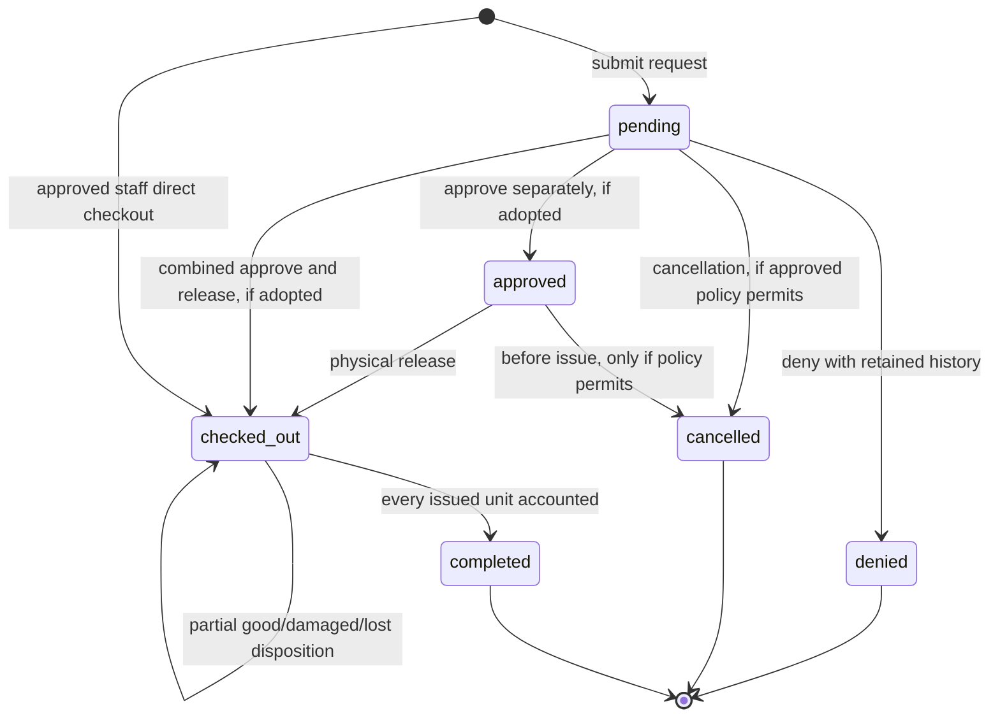
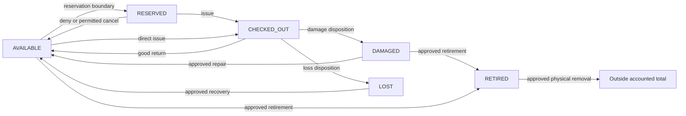
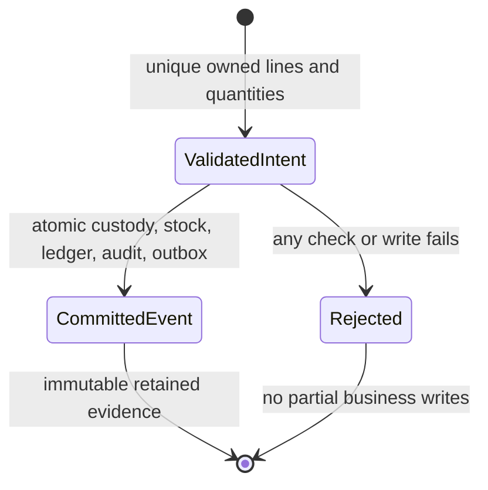
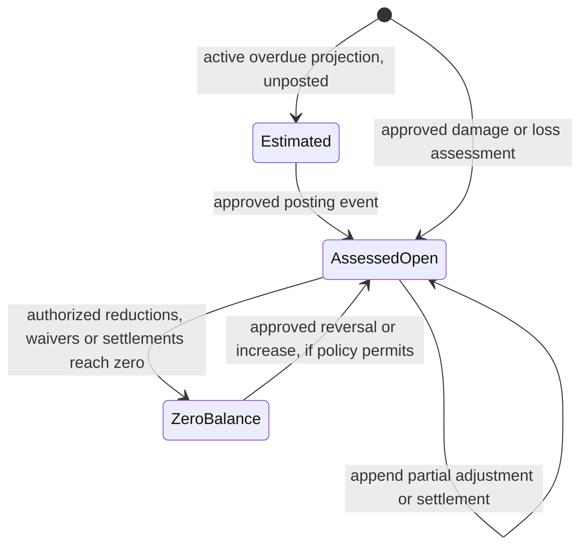

# Phase 2 state machines and scenario review

Design review draft, 2026-10-08. All proposed states/edges below are **ENGINEERING RECOMMENDATION**, subject to the [policy gate](BUSINESS_RULES.md#policy-decision-matrix). V1/boss facts are separately recorded in [compatibility](V1_COMPATIBILITY.md) and [boss reference](BOSS_REBUILD_REFERENCE.md). `approved` and cancellation are conditional choices, not confirmed workflow requirements.

## Borrowing

Terminal arrows end the lifecycle, not database retention. An unsent cart/draft exists only in client interaction state unless persistence is later required. It owns no reservation. Derived `partial` means some dispositions exist and some issued custody remains; `due_today` and `overdue` come from the one approved business calendar. They do not multiply stored lifecycle enums. Completed disposition may contain loss/damage and open charges. A lost declaration is not an overdue status.

No pending/approved borrowing may contain issued custody. Recommended initial contract issues all requested quantities atomically; no partial approval/issue or active cancellation. Those would need another stakeholder requirement/design. `requested_qty`, `reserved_qty` and `issued_qty` remain distinct; issued snapshots are absent before actual checkout.

## Formal borrowing transition contract

Actor labels mean **future approved operation capability**, not currently accepted student/staff/admin grants. Every mutation uses current-account authorization and the [database transaction/lock protocol](DATA_MODEL.md#transactions-and-lock-order). Audit/outbox/receipt creation is part of the business transaction; notification entries are candidates whose precise triggers/content remain OPEN-017/025. Failure of any required persistence rolls back every effect.

| From | Action → To | Actor | Preconditions | Inventory effect | Durable history | Proposed notification | Principal failure |
|---|---|---|---|---|---|---|---|
| Unsent intent | Submit → pending | Eligible borrower or explicitly approved attributed assistance | Unique positive lines; active catalog; current eligibility/terms/due; capacity if A | A: available→reserved; B: none; C deferred | Canonical header/items, request snapshots, acceptance ref, submission audit | Request confirmation keyed by borrowing ID | BORROWER_NOT_ELIGIBLE, EQUIPMENT_NOT_AVAILABLE, invalid due/terms/lines |
| pending | Approve → approved (separate option) | Approval capability | Fresh state/borrower/equipment; current suitable due; all requested stock held or available; approved authority | A: keep hold; B: available→reserved | Decision actor/time, audit; keep request time/snapshots | Approval keyed by decision event | BORROWING_STATE_CONFLICT, BORROWER_NOT_ELIGIBLE, STOCK_CONFLICT |
| pending | Approve and release → checked_out (combined option) | Approval + issue capabilities | Every issue precondition; same atomic command, no inference that approve UI proves custody | reserved→checked_out if held; otherwise available→checked_out | Decision and release actor/times; issued snapshots/quantities, movements, audit | Checkout/approval event with approved trigger distinction | State/eligibility/availability/due/terms conflict |
| pending | Deny → denied | Denial capability | Pending; agreed reason rule; no custody | Restore only actual held reserved→available; B: none | Retained denied header/items + actor/time/reason/audit | Denial keyed by decision event | State conflict; reason validation |
| pending | Cancel → cancelled (conditional) | Owner or cancellation capability as approved | Approved actor/stage policy; no issued custody | Restore actual held quantity only | Retained cancellation time/actor/reason/audit | Cancellation if approved | Permission/state conflict; policy disabled |
| approved | Cancel → cancelled (conditional) | As approved for post-approval cancellation | No checkout; approved actor/stage policy | reserved→available | Retained approval + cancellation evidence/audit | Cancellation if approved | State conflict; policy disabled |
| approved | Physical release → checked_out | Issue capability | Fresh borrower/account/catalog eligibility, policy/terms/due; coherent hold; all lines issued atomically | reserved→checked_out; no second availability decrement | Actual release actor/time, immutable issue snapshots, movements/audit | Checkout keyed by issue event | Ineligible borrower, inactive/archived equipment, stale state/due/hold |
| New | Direct checkout → checked_out (conditional policy) | Direct-issue capability | Existing active eligible borrower; active catalog; capacity; approved due/direct exception/terms; authorized channel attribution | available→checked_out | Canonical transaction, requested=issued in this path, issue snapshots, movements/audit | Checkout | Target ineligible, unavailable, policy/terms/state conflict |
| checked_out | Partial good return → checked_out | Return capability | Unique owned lines; each submitted disposition≤outstanding; event total>0 | checked_out→available by good quantity | Immutable event/lines; cumulative totals; movements/audit | Return keyed by ReturnEvent ID | DUPLICATE_RETURN_ITEM, RETURN_EXCEEDS_OUTSTANDING, ownership conflict |
| checked_out | Damaged disposition → checked_out or completed | Return/disposition capability | Same return checks; required notes/evidence policy; approved assessment timing | checked_out→damaged | Event/lines, cumulative damaged, movement; assessment when due; audit | Return/accountability event | Over-return/notes/assessment-policy conflict |
| checked_out | Lost disposition → checked_out or completed | Loss-recording capability | Same checks; loss reason/evidence/authorization; no claim of physical good return | checked_out→lost | Event/lines, cumulative lost, movement; assessment when due; audit | Return/accountability event | Over-return/notes/authority/assessment-policy conflict |
| checked_out | Final mixed return → completed | Return/disposition capabilities | All line outstanding becomes 0; proposed totals reconcile; no payment prerequisite | Apply good/damaged/lost vector once per normalized line | Event/lines, completion time, movements, required charges/audit | Completion keyed by final ReturnEvent ID | Any per-line/persistence mismatch rolls back whole event |
| checked_out | Clock passes deadline → same stored state | Projection/scheduler | Outstanding>0; one approved calendar/cutoff | None | No synthetic status-write history needed | Reminder event keyed by approved local-date/window and policy version | Unsupported time policy; duplicate event key is safely deduped |
| denied/cancelled/completed | Any issue/return/decision → rejected | Any | Terminal canonical state | None | Original evidence retained | None | BORROWING_STATE_CONFLICT |

Damage/loss are return-event dispositions under one command; they do not create separate parallel mutation endpoints. Approval rejection after checkout cannot “restore” stock as denial. Denial cannot delete a transaction. No arbitrary status PATCH is proposed.

## Inventory lifecycle and movements

These arrows describe integer movement vectors within a pool, not per-physical-unit states. Recovery may require condition inspection and damaged rather than available destination; exact repair/recovery/write-off rules OPEN-022. Movement rows retain the earlier loss even after recovery. Permitted stocktake correction never changes reserved/checked_out to mask custody inconsistency.

| From / action | To | Guard | Quantity/history effect |
|---|---|---|---|
| New pool / initial stock | active or inactive per approved setup | Inventory authority; nonnegative counts, documented baseline | Initial movement explains starting counts; no invented legacy history |
| active / inactivate | inactive | Catalog authority/version; reason | Counts unchanged; existing reservations/custody retained; new release blocked by recommendation |
| inactive / reactivate | active | Catalog authority; agreed condition suitability | Counts unchanged; metadata audit |
| active or inactive / archive | archived | Proposed guard reserved=checked_out=0 and matching cross-row sums | Counts/history remain; archive audit; no new stock issue |
| archived / return attempted | unchanged | Archived/outstanding combination is inconsistent under proposed archive guard | Reject/flag inconsistency for reviewed repair; never delete evidence |
| inactive / receive existing return | inactive | Valid outstanding custody and return authority | Counts move despite inactive catalog; never makes it borrowable until reactivated |
| damaged / repair | available | Approved inspection/repair policy, actor/reason | -damaged/+available, total unchanged, append movement/audit |
| available or damaged / retire | retired | Approved retirement policy; no custody manipulation | -source/+retired, total unchanged, append movement/audit |
| retired or lost / approved removal/write-off | outside total | Confirmed disposition procedure, actor/reason | -source, -total with new movement; historical loss/charge unchanged |

## Return-event lifecycle and reconciliation

Intent states are conceptual application steps, not a stored workflow/status table. Replaying an idempotency key returns the committed event identity; it cannot append another event. A changed payload with the same key conflicts. A second distinct key is still subject to outstanding checks under the borrowing lock.

For each issued line `issued = good_returned + damaged + lost + outstanding`; all quantities are nonnegative integers. Submitted processed sum cannot exceed locked current outstanding. Cumulative totals equal sums of immutable event lines. Stock movement for each event line is `checked_out -= good+damaged+lost; available += good; damaged += damaged; lost += lost`. Completion occurs if and only if every issued line outstanding=0 and the command's equipment/custody/ledger deltas reconcile. A database CHECK on total stock alone cannot establish this.

| Example (one pool/issued line unless noted) | Events | Result |
|---|---|---|
| Full good, issued=3 | E1 good=3 | outstanding=0; checked_out decreases3, available increases3; completed |
| Partial good, issued=3 | E1 good=1; E2 good=2 | outstanding2 then0; two immutable events, two distinct notice keys |
| Mixed good+damaged, issued=4 | E1 good=3 damaged=1 | outstanding0; available+3, damaged+1; completed, financial assessment separately governed |
| Mixed damage+loss, issued=3 | E1 damaged=1 lost=2 | outstanding0; damaged+1, lost+2; completed; available unchanged |
| Multiple events, issued=5 | E1 good=1; E2 damaged=1; E3 good=2 lost=1 | totals good3/damaged1/lost1/outstanding0; every event retained |
| Duplicate payload item, issued=2 | Two lines for same item each good=1 | Reject entire event before writes; DB unique reinforces; outstanding remains2 and stock unchanged |
| Concurrent returns, issued=2 | E1/E2 each good=2 with different keys | Borrowing lock serializes; one commits, second sees0/state conflict; stock restored exactly2 |
| Failure after first of two equipment lines | Event/item/stock/ledger or required audit/outbox fails before commit | Roll back all lines/header/counters/movements/charges/receipt; no partial stock restoration |

## Accountability lifecycle

Estimated is a calculation, not a Charge row. Open/zero balance are derived from immutable assessment and signed adjustments, not mutable parallel statuses. Policy may restrict increasing/reversing a zeroed obligation; OPEN-007/024. An approved real Payment is a separate receipt/allocation branch, never an automatic transition from zero balance.

| Action | Guard / actor | Persisted effect | Failure |
|---|---|---|---|
| Assess | Approved source/window/basis/currency; assessment capability | Immutable Charge, unique source key, audit/outbox | Duplicate source, unavailable/unapproved policy, invalid amount |
| Reduce / waive | Approved authority/reason; positive amount≤current balance | Append adjustment, base unchanged; recomputed outstanding | ACCOUNTABILITY_CONFLICT / negative balance |
| Settle administratively | Approved settlement procedure/authority; positive amount≤balance | Append settlement evidence, no automatic cash claim | CHARGE_ALREADY_SETTLED / policy conflict |
| Increase / reverse | Explicitly approved correction authority/basis; reversal bounded against original adjustment | Append referenced correction; historical amounts retained | Duplicate/over-reversal, authority/policy conflict |
| Edit/delete assessment/adjustment | Not a normal command | None | Immutable evidence violation |

## Fifteen required walkthroughs

These are **design traces, not executed tests**. Illustrative quantities are hypothetical integers, not institutional limits. Where policy is open, alternatives are traced rather than reported as accepted workflows. Invariant IDs map to [INVARIANTS](INVARIANTS.md).

| Scenario | Trace and expected evidence/outcome | Policy / future test |
|---|---|---|
| S01 Normal request→approval/release→full good | Pool starts available3. Request2: A gives available1/reserved2; B unchanged3. Separate approve: A retains hold, B gives1/2. Release gives available1/reserved0/checked_out2. Good2→available3/checked_out0; retained completed borrowing, event/ledger/audit | OPEN-020/021/016/015; INV-01–07, BOR-01–05, RET-01–07; real PG/HTTP |
| S02 Denied request | A hold2 restored; B has no stock movement. State denied retains ID/items/decision/audit and unique notice; no active record deletion | Reason OPEN-014; BOR-06, HIS-01; PG/HTTP |
| S03 Cancelled request if supported | Owner/staff policy checked; pending or allowed approved hold released exactly once; retained cancelled state. If unsupported, command absent | OPEN-013/021; BOR-06, AUTH-01, CMD-01; PG/HTTP/browser later |
| S04 Staff direct checkout | Current operator and target borrower checked; available2→checked_out2; request/issue evidence directly canonical; duplicate key replay creates no additional custody | OPEN-020/002/003/016; ELG-01–03, CMD-01; PG/HTTP |
| S05 Partial good then final | Issue3, E1 good1 leaves2, E2 good2 leaves0. Two events/notice keys; availability increases1 then2, same borrowing completes | RET-02/03/06/07, NTF-01; PG |
| S06 Good and damaged | Issue3, good2/damage1 gives0 outstanding and completed; available+2/damaged+1, immutable event. Approved assessment uses frozen basis once | OPEN-022/023/024; RET-04, ACC-01/04; PG/unit |
| S07 Lost equipment | Issue1, loss1 gives lost+1/checked_out-1; accounted total unchanged; completed custody and independently outstanding accountability | OPEN-006/022; INV-02/08, RET-04/06, ACC-05; PG |
| S08 Two requests for last available unit | A: sorted equipment lock yields one hold, second availability conflict. B: both pending allowed, but only one approval/reservation/issue can win; request UX cannot promise hold | OPEN-020; INV-03/09, BOR-02; PG concurrency |
| S09 Two staff same approval/checkout | Both lock same borrowing; first moves legal edge, second state conflict; same command key instead replays original identity after current authorization | OPEN-021; BOR-03, CMD-01/02; PG concurrency/HTTP |
| S10 Concurrent duplicate return | Same key/payload produces one event; different key over-return loses under lock. Duplicate item IDs in either request rejected regardless of key | RET-01/02, CMD-01; PG concurrency/HTTP |
| S11 Borrower inactive after request | Inactivation writer and release share ordered user/profile locks. If inactivation commits first, release rejects; holds remain until authorized deny/cancel, not silently lost. If release commits first, preserve issued custody/returns | OPEN-008; ELG-02/03, AUTH-02; PG concurrency |
| S12 Equipment archived after request | A hold or B approved hold blocks proposed archive. B unheld pending may coexist with archive; later approval/release rejects. Inactivate also blocks new release without discarding hold/history | OPEN-012/020; INV-10, ELG-03; PG concurrency |
| S13 Charge adjusted | Example assessment1000 minor units; waiver200 and settlement300 yields outstanding500. Base1000 unchanged; all actors/reasons retained. Excess adjustment conflicts; do not report500 settlements as verified revenue | OPEN-007; ACC-01–06; PG/unit |
| S14 Catalog value changed after old issue | Old issue valuation stays immutable; new catalog value affects new capture per approved policy. Old damaged-return liability uses old frozen basis; request-to-issue price change exposes OPEN-023, cannot be silently repriced | HIS-02/03, ACC-04; PG/HTTP |
| S15 Notification provider fails after commit | Successful business transaction retains state/event/outbox/receipt. Worker appends failure and schedules bounded retry/dead-letter; delivery failure cannot undo custody; no same partial-return key suppression | OPEN-017/025; NTF-01–03, HIS-04; PG/worker/provider test later |

All 15 scenarios are representable as conditional design traces. S01/S03/S04/S08/S09 depend on the approved state/reservation/actor/terms contract; S06/S07/S13/S14 require assessment/value/payment policy. S12 depends on archival policy. They are not implemented or institutionally accepted. The model is **BLOCKED FOR IMPLEMENTATION**, not “complete because every scenario has a table row.”
