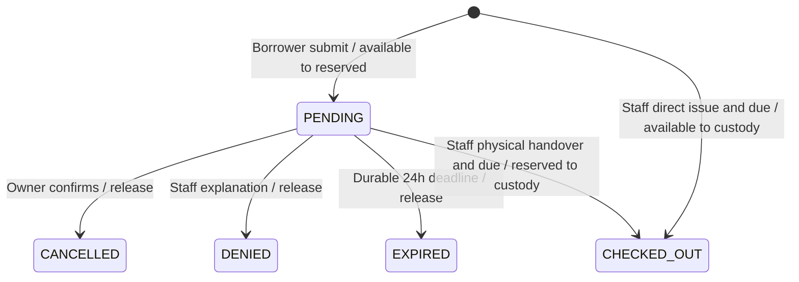

# Phase 2.5 state machines and design walkthroughs

**Phase 7 execution update, 2026-10-09:** The owner authorized complete milestones 7A–7D from baseline `366b6ef`. Borrowing/reservation/physical-checkout implementation and final verification are recorded in [the completion report](../project/PHASE7_COMPLETION_REPORT.md). Current source and the Phase 7 sections govern these surfaces; earlier unstarted/unauthorized statements are historical checkpoints. New-screen owner acceptance remains pending. Phase 8 is not started. Official FSMO publication/current acceptance, approved production Student domains and verified live activation delivery remain external gates.

**Current Batch1 implementation,2026-10-09:** Phases5–6 now implement the scoped account/catalog/inventory boundaries described in the overlays below and current API_CONTRACTS.md. Earlier unimplemented/candidate statements are historical Phase2/4 design evidence, not current status. See PHASE5_REPORT.md (external-gate partial) and PHASE6_REPORT.md (reviewed inventory scope complete). Phase7 remains unauthorized.


2026-10-08. Working product decisions DEC-051–061 govern; exact transaction mechanics are selected engineering recommendations. These are **design traces, not executed tests**. [Rules](BUSINESS_RULES.md), [schema](DATA_MODEL.md) and [invariants](INVARIANTS.md) define later acceptance.

## Borrowing lifecycle

```mermaid
stateDiagram-v2
    [*] --> PENDING: submit; reserve immediately
    [*] --> CHECKED_OUT: staff direct physical issue
    PENDING --> CHECKED_OUT: approve and hand over atomically
    PENDING --> DENIED: staff reason; release hold
    PENDING --> CANCELLED: owner cancel; release hold
    PENDING --> EXPIRED: 24h deadline; release hold
    CHECKED_OUT --> CHECKED_OUT: partial return / damage / loss / partial replacement
    CHECKED_OUT --> COMPLETED: every physical and replacement outstanding = 0
```



DENIED/CANCELLED/EXPIRED/COMPLETED are retained terminal rows, not deletes. There is no APPROVED state, separate release edge or partial/overdue status enum. `entry_path` REQUEST/DIRECT and timestamps preserve the route taken. Final return/acceptance performs completion internally, not a separate client transition.

| Command | Actor / starting state | Locked preconditions | Atomic result |
|---|---|---|---|
| Submit | Active Borrower / new | Current terms accepted; nonempty unique lines; sufficient available | PENDING; A−q/R+q; submission/expiry evidence, audit, outbox, receipt |
| Approve and release | Staff/Admin / PENDING | Not expired; current active borrower; held quantities usable; due_at future; operational accountability reviewed | CHECKED_OUT; R−q/C+q; decision_at=checked_out_at at same edge; issue snapshots/fine basis/audit/outbox/receipt |
| Deny | Staff/Admin / PENDING | Not expired; nonempty visible reason | DENIED; R−q/A+q; reason and history/audit/outbox/receipt |
| Cancel own pending | Owner Borrower / PENDING | Not expired; owner and active account | CANCELLED; R−q/A+q; history/audit/receipt; optional cancellation notice |
| Expire | System / PENDING | Locked now>=expires_at | EXPIRED; R−q/A+q; expired_at/history/audit/outbox; unique expiry source |
| Direct checkout | Staff/Admin / new | Active existing borrower; current terms evidence; available stock; future due_at | CHECKED_OUT directly; A−q/C+q; issue/fine basis/audit/outbox/receipt |
| Record return/disposition | Staff/Admin / CHECKED_OUT | Unique item IDs belonging to borrowing; good+damage+loss<=physical remaining | Exact stock/counter/event/incident/obligation effects; remain open or complete; audit/outbox/receipt |
| Accept replacement | Staff/Admin / CHECKED_OUT | Unique obligation IDs; same borrowing; accepted<=locked unresolved; appropriate type/equivalence | New A+q/total+q and immutable acceptance; reduce liability; remain open or complete; audit/outbox/receipt |
| Clear full fine | Admin / issued open or completed | Entire current positive outstanding; expected balance matches | Immutable clearance; no borrowing/stock/due/incident mutation |

No issued borrowing returns to PENDING or cancels/deletes. Staff administrative pending cancellation is an optional future scoped recommendation, excluded from required edges until needed. Inactive targets cannot receive new issues, but Staff/Admin can resolve existing loans.

## Student account deactivation boundary (DEC-073)

Admin may change a Student account from active to inactive individually or through the Student-only bulk workflow for graduation/withdrawal/transfer/other authorized deactivation, regardless of fines, active/overdue borrowing, unreturned equipment or replacement obligations. Display appropriate warnings and require confirmation; obligations do not prohibit this account-status transition. Current Admin and Student identity/category checks remain authoritative; bulk excludes Faculty/Staff/Admin and preserves reviewed selection/audit/retries.

This account transition produces no borrowing lifecycle edge, stock movement, payment/fine clearance, return or replacement acceptance. Preserve due dates, unresolved states and balances, overdue calculations and immutable history. Deactivation does not automatically close a loan or erase liability; normal overdue calculation and independent approved lifecycle transitions retain their existing rules. FSMO resolves separately through Staff/Admin return/replacement processing and Admin-only auditable fine clearance. Existing inactive-account authentication boundaries remain unchanged; OPEN-029 is resolved.

## Associated projections

**Return authority (D17 clarified):** The borrower attends a face-to-face return and may physically show a photo stored on their own phone. Staff/Admin may inspect the actual equipment if desired and alone records authoritative condition/quantities in eLabTrack. The software then updates borrowing and inventory. Photo viewing is entirely outside the system: no borrower return/evidence submission, returned toggle, photo upload/transmission/storage/retention, attachment or evidence step. The machine consumes only Staff/Admin-recorded dispositions; a personally shown photograph creates no software event.

```text
physical P_i = issued_i - good_i - damaged_i - lost_i
replacement U_i = sum(required_i) - sum(accepted_i)
partial_return = sum(good+damaged+lost)>0 AND sum(P+U)>0
replacement_pending = sum(U)>0
currently_overdue = CHECKED_OUT AND sum(P+U)>0 AND now>due_at
completion = all P_i=0 AND all U_i=0
```

An obligation is derived UNRESOLVED if remaining>0, RESOLVED if0; no independently writable status. Replacement accepts do not increment original good return or erase original incident. Stock `C` reconciles only P, never U. A completed late loan retains final overdue days/amount and optional outstanding fine; “currently overdue” applies only to operationally open loans. Fine OUTSTANDING/CLEARED derives amount, not an editable flag.

## Expiry, races and atomicity

Expiration is 24 elapsed hours after submission in absolute time, unaffected by opening hours. Capture authoritative time after obtaining all relevant locks, immediately before the state/quantity decision (the command's linearization point); use that time for its effects. At equality expiry wins. Pending approval/denial/cancel checks lazily expire the row if overdue, commits the release/history, then responds with EXPIRED outcome. Do not raise a transactional exception that rolls back a successfully needed expiration. Competing expiry and checkout lock the same borrowing; only one legal edge consumes the hold.

Future bounded expiration sweeps use an expiry index and the common lock order. A physically persisted hold may remain until a sweep/lazy expiry processes it; availability must not pretend that unprocessed hold was already released. Worker health/lag is observable. Expiry lifecycle is part of borrowing acceptance, not deferred until email provider implementation. No scheduler/provider is built in this task.

Shared command protocol: normalize unique IDs; authenticate and reauthorize; lock participating user rows in sorted ID order, then singleton policy/terms publication boundary if needed, borrowing rows (sorted for bulk), obligation rows, equipment rows sorted by ID, fine row, then receipt/evidence writes. Published-version selectors must be serialized with submission/direct acceptance checks. Every writer of account status, stock, policy publication or borrowing state follows its participating order. Replacement and return commands take borrowing before equipment so last-return/last-replacement completion cannot race. Aggregate multiple obligations for the same equipment once for stock, while preserving each distinct source line in evidence.

Atomic transaction includes rows/counters, immutable return/replacement evidence, exact stock ledger, final fine freeze when closing, required business audit/outbox and successful command receipt. Any failure rolls back all. Delivery failure after commit affects notification attempts only. Same-key retry must reauthorize and return original committed identity; changed payload with same key conflicts. Different-key competing returns/acceptances recheck locked remaining; locks alone do not cure duplicate-line interpretation.

## Eighteen required walkthroughs

For stock vectors use `(A,R,C,D;T)` where D=damaged_held, T=total_tracked. Each row is an independent scenario starting with 5 usable units unless specified; P is physical outstanding, U unresolved replacements. Issue all 5 gives `(0,0,5,0;5)`. Fine basis is PHP 10 per ceiling 24h after original due. Every committed step retains canonical history, ledger, audit and applicable event/outbox/receipt; terminal transitions never erase records.

| # | Scenario | Stock / quantities / lifecycle | Clock, history and expected protection |
|---|---|---|---|
| 1 | Normal full good return | Issue5; good5→`(5,0,0,0;5)`, P0/U0, COMPLETED | Before due final0; one immutable return and completion |
| 2 | Partial good return before due | Good2→`(2,0,3,0;5)`, P3/U0, CHECKED_OUT | Original due unchanged; fine0 until crossed; event retained |
| 3 | Partial then overdue | From #2, due+1min P3/U0 fine10; return3 at due+25h→`(5,0,0,0;5)` completed | Final20 frozen at final return; two events, no rewritten deadline |
| 4 | Lost then replacement before due | Good2/loss3→`(2,0,0,0;2)`, P0/U3, open; accept3→`(5,0,0,0;5)`, P0/U0 completed | Final0; loss3 remains in incident history; no ghost C |
| 5 | Lost then replacement after due | Same loss; due+1min P0/U3 fine10; accept3 at due+25h→`(5,0,0,0;5)` completed | Final20; fine accrues with C0 until acceptance; historical loss remains |
| 6 | Damaged then replacement | Good3/damage2→`(3,0,0,2;5)`, P0/U2; accept2→`(5,0,0,2;7)` completed | Two originals held plus two new usable units; later discard2→T5, incident retained; clock ends at acceptance |
| 7 | Mixed good + damaged + lost | Good2/damage1/loss1 leavesP1: `(2,0,1,1;4)`, U2; good1→`(3,0,0,1;4)`, P0/U2; accept2→`(5,0,0,1;6)` completed | Each step reconciles; no value charge; one damaged original retained; freeze only at last resolution |
| 8 | Pending auto-expiry | Submit2→`(3,2,0,0;5)`; at24h expire→`(5,0,0,0;5)`, EXPIRED | Fine0; hold released once; expired timestamp/history; checkout race loses if expiry point reached |
| 9 | Borrower cancels pending | Submit2; own preexpiry cancel→`(5,0,0,0;5)`, CANCELLED | Fine0; owner only; repeat/different-key cancellation cannot release twice |
| 10 | Deny with visible reason | Submit2; Staff denial→A5/R0, DENIED | Fine0; reason required/preserved/borrower-visible; no destructive delete |
| 11 | Direct checkout | Staff issue2→`(3,0,2,0;5)`, P2/U0, CHECKED_OUT | Active target/current terms/due required; no PENDING or hold artifact; good2 later closes |
| 12 | Old fine, new request | Prior completed loan has fine20; new submit2→`(3,2,0,0;5)`, PENDING | Old fine unchanged; new hold allowed; no automatic fine gate |
| 13 | Staff denies for outstanding fine | From #12 staff reviews and denies with visible reason→A5/R0 | Prior fine20 remains; decision is human action, not automatic submission block |
| 14 | Admin full clear | Completed fine20; Admin PAID clear20→outstanding0/CLEARED | Final20/actor/time/method retained; Staff403; no stock change. Open fine10 clear10, later assessed20→new outstanding10; each clear is full at its time |
| 15 | Terms version changes | Borrower acceptedv1; publishv2; new submit blocked until acceptv2 | No hold on failed submission; one acceptance per version; pendingv1 retains its binding, no per-loan consent |
| 16 | Concurrent last-stock request | Initial `(1,0,0,0;1)`; two submit1 | Exactly one PENDING/`(0,1,0,0;1)`; loser insufficient stock409; no partial headers/evidence, no negative A |
| 17 | Duplicate return submission | Issued2; payload repeats same item good1 twice | Entire request400 before mutation; C2 remains. Same valid-key replay restores once; different-key retry checks physical remaining. UNIQUE(event,item) protects DB; boss first-match defect excluded |
| 18 | Concurrent replacement acceptance | Loss2, P0/U2, `(0,0,0,0;0)`; two commands each accept2 | Borrowing/obligation/equipment locks yield one accepted2, A2/T2/U0 and one completion/freeze; loser409, no second acquisition. Same-key retry replays; duplicate IDs400 |

All 18 are representable by the schema and legal edges. No remaining core state/schema contradiction was found in these design traces. Implementation must prove these with real PostgreSQL transactions/concurrency/fault tests and HTTP permission checks; this reconciliation executes none.


## Phase 4B implemented terms boundary

2026-10-08: immutable terms publication/acceptance and first-use UI are implemented independently of official content approval. Migration 000005 adds `terms_versions`, singleton `terms_publication`, and `terms_acceptances`; no borrowing, inventory, policy/outbox or category persistence is implemented. Immediate mandatory Admin publication uses an expected-current pointer and shared/exclusive row locks, superseding proposed terms scheduling/advisory selection. Historical versions/receipts are append-only; a material update is a new version. Exact public DTOs/errors are in [API contracts](../API_CONTRACTS.md#phase-4b-implemented-terms-contracts).

The owner confirms no official V2 terms text is approved. Normal configured storage has no publication/acceptance; synthetic documents appear only in disposable tests. Missing content or service failure cannot authorize new borrowing. Borrower home/catalog paths request current consent; account/existing obligations/notifications and logout remain accessible. Server evidence is separate from authentication. DEC-070 confirms email plus a separate borrower-chosen eLabTrack password for both categories: Student requires approved SKSU institutional email and unique textual Student ID; Faculty may use any valid unique accessible email and requires no Student ID. Only Admin creates accounts; standard bulk creation/deactivation is Student-only. Single-use activation links target each category’s respective mailbox. DEC-071 selects Brevo for backend-only activation and future password recovery; integration and API-key/verified-sender/successful live delivery verification remain unimplemented (OPEN-017), alongside activation/ownership/recovery and actual SKSU inputs (OPEN-001/009/028). DEC-072 schedules official FSMO terms after application presentation: pending content does not block independent account-management/inventory development under separate authorization, but live borrowing still requires official publication and documented acceptance. See [current account provisioning policy](../project/ACCOUNT_PROVISIONING_POLICY.md).

Phase 7 must authorize the acting account and target Borrower, lock participating accounts in sorted order, then call `terms.Service.RequireCurrentAcceptance(ctx, borrowerID)` **inside the same borrowing command transaction**. Keep its shared publication lock until stock/borrowing/history/receipt commit and bind the returned receipt/borrower through `(id,user_id)` composite FK. Direct checkout checks the target's evidence, never records Staff consent for them. Existing pending submissions retain their original terms binding. No live borrowing endpoint or full business enforcement has been implemented. See [report](../project/PHASE4B_REPORT.md), DEC-066/067 and [tests](../../integration/PHASE4B.md).

## Phase 5 implemented account activation/access

Admin provisioning creates an account with activation_required=true and an unusable bcrypt sentinel, never an assigned reusable password. Trusted single-use email redemption atomically establishes the account holder's bcrypt password, invalidates tokens and records audit; it neither creates a session nor accepts terms nor reactivates an inactive account. Reissue rotates the token subject to cooldown; deactivation invalidates activation and all live refresh credentials, preserving identity/history. Reactivation cannot resurrect an old credential; a pending account needs a fresh link. Existing accounts default to activation_required=false and are not silently migrated into activation. Submission states PENDING/UNCONFIGURED/ACCEPTED/FAILED/UNKNOWN never mean recipient delivery. [Implemented contract](../API_CONTRACTS.md#phase-5-implemented-account-management-contracts).

## Batch1 Phase6 implemented inventory boundary

Paired000007 now implements operator-provided categories, catalog equipment metadata/lifecycle, four physical buckets, immutable movement/audit/command receipts and bounded equipment-only canonical PNG images. `T=A+R+C+D`; Staff/Admin usable acquisition/removal affects A/T only. Admin reviewed expected-sequence reconciliation sets observed A and preserves R/C/D; no custody or incident correction. Current per-pool quantity bound is2147483647; all arithmetic is checked server-side and by PostgreSQL. Loss history and replacement liability remain separate future concepts, with no invented current lost bucket or zero liability projection.

Equipment ACTIVE is Borrower-visible; INACTIVE/ARCHIVED is operational-only. Archive retains current stock/history, blocks R/C, and requires verified absence of future borrowing/replacement tables; their presence without integrated liability checks fails closed. No archival return/settlement, repair/disposal, borrowing, reservation, replacement or fine workflow exists. Metadata and stock versions are separate; locked transactions make movements/audit/receipts atomic, idempotent and stale-basis safe. Category inactivity preserves existing references. Local database image support is bounded PNG/JPEG re-encoding for catalog use only, not return photographs or arbitrary storage. Actual routes/limits/storage/permissions and future integration requirements are in [API contracts](../API_CONTRACTS.md#phase-6-implemented-equipment-and-inventory-contracts). Historical Phase2/4 candidate/unimplemented descriptions above are dated design evidence, superseded for these scoped implemented surfaces.

## Phase 7 actual lifecycle and expiration



These are all implemented edges. No separate APPROVED or Phase8 completion/return edge exists. Staff approval is atomic checkout. At deadline equality, expiry wins; clock is captured after equipment locks. A late cancel/deny/approve commits EXPIRED and release, stores its receipt, then returns409 BORROWING_EXPIRED. Replaying this late decision repeats409 without consuming another hold.

The API process runs an immediate catch-up sweep and a30s ticker; each10s cycle processes at most100 indexed persisted candidates through the same account→borrowing→equipment lock order. Each candidate is a separate transaction with conditional PENDING consumption. Restart and concurrent workers do not depend on remembered timers. Inactive borrowers' holds still expire. Physical availability remains the stored value until release commits; no read pretends a held unit is free. Bounded backlog/outage delay and lack of a dedicated worker lag dashboard are disclosed; no Redis/message broker/email dependency is introduced.

Read-only own history remains accessible without current terms. Current terms are locked/bound inside new submission and direct issuance; existing pending checkout retains its original consent. Due times are absolute timestamptz and rendered in Manila, with no duration maximum. Current deactivation and future resolution authority remains unchanged.
