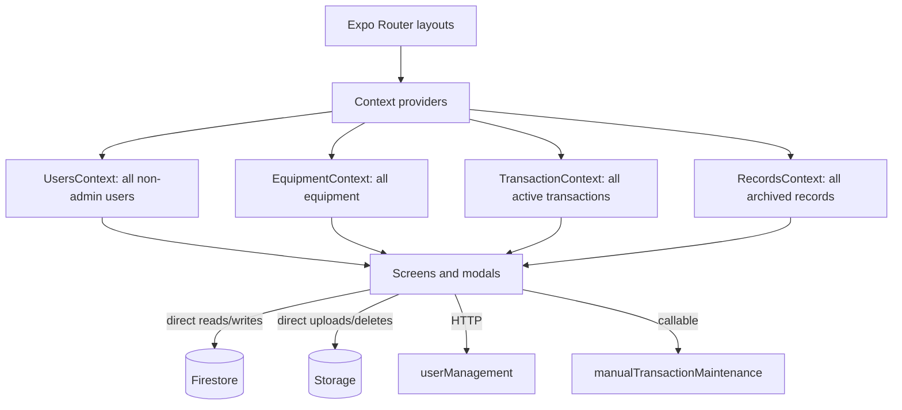

# 1. System overview

## Product purpose and users

**Fact.** The login screen calls the product “eLabTrack” and “Laboratory Equipment Borrowing System” (`app/index.tsx`). V1 manages users, aggregate equipment inventory, borrowing requests, staff-created checkouts, approvals/denials, partial and final returns, overdue fines, archived records, reminder queue entries, and administrative reports.

The represented roles are `student`, `staff`, and `admin` (`context/UsersContext.tsx`, `context/AuthContext.tsx`). In practice:

- Students use the `/user` application: dashboard, inventory discovery, request creation, history, terms, and profile editing.
- Staff and admins are routed to the same `/admin` application and pass the same `AdminGuard`. There is no operational distinction between these roles in the client.

There is no public sign-up flow. Accounts are provisioned through administrative UI and a privileged Cloud Function.

## Major capabilities

| Area | Implemented behavior | Primary evidence |
|---|---|---|
| Authentication | Email/password login, logout, password-reset email, Firebase session listener | `app/index.tsx`, `context/AuthContext.tsx` |
| Users | Single/bulk creation, bulk deletion, profile/status editing, profile image, borrower detail | `app/admin/users.tsx`, `_modals/*User*`, `createUser/functions/src/index.ts` |
| Inventory | Create/edit/delete aggregate equipment records, images, search, status/condition display | `app/admin/inventory.tsx`, `_modals/*Equipment*` |
| Borrowing | Student requests and staff-created transactions; approval, denial, partial/final return | `app/user/create-transaction.tsx`, `_modals/addTransactionModal.tsx`, `_helpers/firebaseHelpers.ts` |
| Tracking | Active status, due/overdue maintenance, damaged/lost accounting, stock counts | `context/TransactionContext.tsx`, `overdueChecker/functions/src/index.ts` |
| History | Completed transactions moved to `records`; student and admin history views | `context/RecordsContext.tsx`, `app/*/records.tsx` |
| Fines | PHP 10/day overdue plus unit-price damage/loss charges; administrative clearing in records | `_helpers/firebaseHelpers.ts`, `_modals/userDetailsModal.tsx` |
| Notifications | Firestore queue documents for approval, denial, due, reminder, overdue, and receipt messages | `_helpers/firebaseHelpers.ts`, `overdueChecker/functions/src/index.ts` |
| Reporting | Web-printable inventory/users/history plus client-computed charts | `app/admin/inventory.tsx`, `users.tsx`, `reports.tsx` |

Not found: QR/barcode scanning, serial-number/unit tracking, category management, maintenance work orders, organizational tenancy, push/local notifications, reservation waitlists, or external APIs other than Firebase/Google-hosted function endpoints and a remote fallback image.

## Actual technology stack

| Technology | Version/evidence | Actual V1 role |
|---|---|---|
| React | `19.1.0` | Component model and local state |
| React Native | `0.81.5` | Cross-platform UI runtime |
| Expo | `^54.0.7` | Mobile/web runtime and build/export commands |
| Expo Router | `~6.0.4` | File-based Stack and Drawer navigation |
| TypeScript | `~5.9.2`, strict root config | Application language; several `any` escape hatches remain |
| Firebase JS SDK | `^12.8.0` | Auth, Firestore, Storage, callable Functions |
| Firebase Admin/Functions | separate Node 20 and Node 24 projects | User administration; scheduled/callable maintenance |
| React Context + hooks | local contexts | Global snapshots and derived statistics; no Redux/Zustand |
| Gluestack UI v3 sources | `@gluestack-ui/core`, generated `components/ui` | Reusable UI primitives |
| NativeWind/Tailwind | NativeWind 4, Tailwind 3 | Utility-class styling and Metro integration |
| React Navigation Drawer | v7 | Drawer implementation beneath Expo Router |
| Chart Kit/SVG | `react-native-chart-kit`, `react-native-svg` | Client-side report charts |
| SheetJS (`xlsx`) | `^0.18.5` | Excel user import/delete input and web template output |
| Expo image/document pickers | versions in `package.json` | Images and spreadsheet selection |
| Firebase Hosting | root `firebase.json` | Serves static `dist` with SPA rewrite |

No dedicated form-validation library or date library is used. Validation is handwritten; date calculations use JavaScript `Date` and Firestore `Timestamp`.

## Architecture and data flow

The application is a “smart client”: screens and modal components call Firebase directly, while four contexts subscribe to entire top-level collections. A helper module centralizes some transaction logic, but equivalent creation code is duplicated in student and admin UIs. Cloud Functions are not the sole business-logic boundary.

## Primary journeys

1. A staff/admin creates an account. The HTTP function creates Firebase Auth, a `users/{uid}` document, optional profile image, and a role custom claim.
2. A student signs in. The client authenticates, queries `users` by its `uid` field, verifies `status === active`, and routes by role.
3. A student browses the global equipment list, accepts terms once, selects a due date within seven days, and submits a request. Stock is reserved immediately.
4. Staff/admin approve (state becomes `Ongoing`) or deny (stock restored, transaction deleted) the request.
5. Staff/admin record good, damaged, or lost quantities over one or more returns. Good units become available; all processed units leave borrowed quantity.
6. When all quantities are accounted for, a history record and optional fine record are created, a receipt notification is queued, and the active transaction is deleted.
7. Scheduled maintenance updates status/fines and queues tomorrow/due-today/overdue email-shaped notification documents.

## Architectural observations

- **Observation:** “Transaction” combines request, reservation, checkout, loan, and return state. There are no separate reservation/loan/event entities.
- **Observation:** `records` is a copied terminal snapshot, not an immutable event stream; request denial and manual active-transaction deletion leave no audit record.
- **Observation:** role claims are written by the user function, but the client authorizes from mutable Firestore profile fields; rule enforcement is unknown.
- **Observation:** the model is global and department-specific rather than tenant/lab scoped. See `10-scalability-audit.md`.

