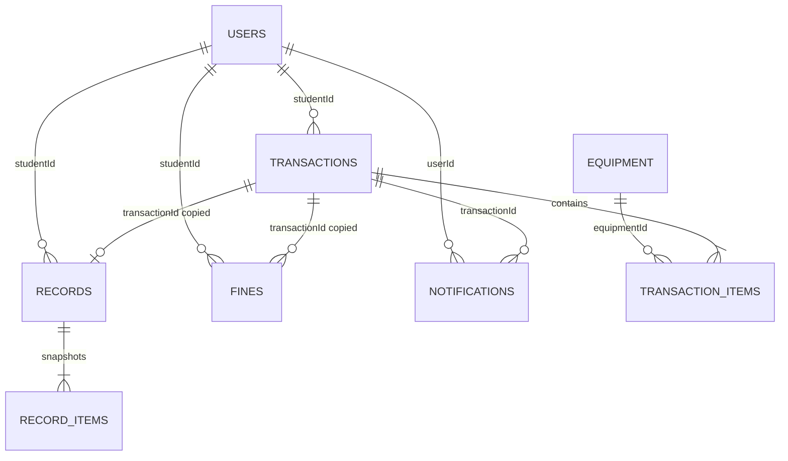

# 4. Firestore data model

## Scope and conventions

All discovered collections are top-level. No subcollection access was found. “Required” below means written by the principal constructor or relied upon without a durable fallback; deployed legacy documents may differ. Document IDs are Firestore auto IDs unless stated otherwise.

Relationships are string identifiers, not Firestore `DocumentReference` fields, and are not referentially enforced by repository code.

## `users`

**Purpose:** Firebase Auth profile, application role/status, contact/profile information, and terms acceptance.  
**ID strategy:** Firebase Auth UID when created by `userManagement`; contexts treat document ID as UID. A duplicate `uid` field is also stored and queried.  
**Created by:** HTTP user-management function.  
**Updated by:** student profile screen; admin user details; student terms acceptance; unused helper.  
**Read by:** login/AuthContext; global UsersContext; transaction creation/admin user screens.  
**Lifecycle:** active profile may be set inactive/suspended; deletion removes Auth user, Storage image, then document. Historical records retain copied identity fields.

| Field | Type | Required/notes |
|---|---|---|
| `uid` | string | Required; duplicates document ID |
| `email` | string | Required; also stored in Firebase Auth |
| `name` | string | Required; admin creation derives from email local part |
| `role` | `student \| staff \| admin` | Required |
| `course` | string | Required by server; admin UI sends `N/A` |
| `contactNumber` | string | Required by server; Philippine-format validation, except admin UI sends `N/A` |
| `status` | `active \| inactive \| suspended` | Created as `active`; some editing types only expose active/inactive |
| `imageUrl` | string | Optional/empty string; public or Storage download URL |
| `imagePath` | string | Optional/empty string; Storage object path |
| `createdAt`, `updatedAt` | timestamp | Server timestamps on creation; some client updates use JS `Date` |
| `agreedToTermsAndCondition` | boolean | Optional; reader defaults false; written on first request |
| `termsAcceptedAt` | timestamp | Optional; written with terms acceptance |
| `id` | string | Legacy/optional; helper interface and context fallback reference it |

## `equipment`

**Purpose:** aggregate stock-keeping records, not individually serialized units.  
**ID strategy:** Firestore auto ID.  
**Created/updated by:** staff/admin client UI.  
**Read by:** global context, request/direct-checkout screens, reports, transaction return logic.  
**Lifecycle:** created with all quantity available; borrowed/available counts mutate; hard deletion allowed only after a client scan finds no active transaction; image deletion is best effort.

| Field | Type | Required/notes |
|---|---|---|
| `name`, `description` | string | Required by add/edit forms |
| `totalQuantity` | number | Positive integer on add |
| `availableQuantity` | number | Initialized to total; adjusted by borrowing/returns/edits |
| `borrowedQuantity` | number | Initialized 0; adjusted by borrowing/returns |
| `pricePerUnit` | number | Non-negative; used as value/rental total and damage/loss fine basis |
| `condition` | `good \| fair \| needs repair` | Required enum in UI/types |
| `status` | `available \| unavailable \| maintenance` | Required enum; discovery selects `available` |
| `imageUrl`, `imagePath` | string | Optional/empty; Storage metadata |
| `createdAt`, `updatedAt` | timestamp | Server timestamps on form writes |

No category, serial number, asset tag, model, calibration, maintenance history, department, campus, building, room, laboratory, custodian, or archive flag was found.

## `transactions`

**Purpose:** requests and all nonterminal active loans.  
**ID strategy:** Firestore auto ID. A separate display `transactionId` uses `TXN-YYYYMMDD-<last six milliseconds>` and is not guaranteed collision-proof.  
**Created by:** student request, admin/staff direct checkout, or helper equivalent.  
**Updated by:** approval, partial return, scheduler/manual maintenance, deletion.  
**Read by:** global TransactionContext; all dashboards; equipment deletion/details; maintenance.  
**Lifecycle:** `Request` → active states; denied requests are deleted; fully accounted transactions are copied to `records` then deleted.

| Field | Type | Required/notes |
|---|---|---|
| `transactionId` | string | Human-facing identifier |
| `studentId` | string | UID → `users` |
| `studentName`, `studentEmail` | string | Denormalized identity snapshot |
| `items` | array<object> | Required embedded line items; schema below |
| `borrowedDate` | timestamp | Request submission initially; reset to server time on approval |
| `dueDate` | timestamp | Required |
| `status` | status string | See state list below |
| `totalPrice` | number | Sum of quantity × snapshotted unit price |
| `fineAmount` | number | Overdue and/or return fine, depending lifecycle point |
| `createdAt`, `updatedAt` | timestamp | Required by primary constructors |
| `ondueNotified`, `reminderNotified`, `overdueNotified` | boolean | Notification idempotency flags, initialized false |

Embedded `items[]`:

| Field | Type | Notes |
|---|---|---|
| `id` | string | Client-generated line ID |
| `equipmentId` | string | → `equipment` document ID |
| `itemName` | string | Denormalized snapshot |
| `quantity`, `pricePerQuantity` | number | Borrowed quantity and snapshotted unit price |
| `returned` | boolean | Set from return UI checkbox; status logic inconsistently relies on it |
| `returnedQuantity`, `damagedQuantity`, `lostQuantity` | number | Cumulative disposition counts |
| `damageNotes` | string | Required by UI when damage/loss entered |

Observed transaction status vocabulary: `Request`, `Ongoing`, `Ondue`, `Overdue`, `Incomplete`, `Incomplete and Ondue`, `Incomplete and Overdue`, `Complete`, `Complete and Overdue`. Terminal values normally live only transiently because completion archives and deletes the transaction. `_types/index.ts` omits the two `Ondue` variants, demonstrating type drift.

## `records`

**Purpose:** terminal transaction snapshots/history.  
**ID strategy:** auto ID, not the source transaction document ID.  
**Created by:** `completeTransaction` when all quantities are accounted for.  
**Updated by:** admin “pay all fines” flow mutates fine fields.  
**Read by:** global RecordsContext, student history, admin reports, borrower details.  
**Lifecycle:** retained indefinitely in code; no delete/archive cleanup flow found.

| Field | Type | Required/notes |
|---|---|---|
| `transactionId` | string | Copied display ID (fallback to Firestore source ID) |
| `studentId`, `studentName`, `studentEmail` | string | Reference plus snapshots |
| `items` | array<object> | Final embedded item snapshots, same shape as transactions |
| `borrowedDate`, `dueDate` | timestamp | Copied |
| `returnedDate`, `completedDate`, `archivedAt` | timestamp | Written at final completion |
| `finalStatus` | `Complete \| Complete and Overdue` in normal writer; readers also allow incomplete/overdue values | Type/writer discrepancy |
| `totalPrice`, `fineAmount` | number | Copied total and calculated final fine |
| `notes` | string | Created empty |
| `createdAt` | timestamp | Copied from transaction (reader interface does not consistently expose it) |
| `finePaid` | boolean | Reader expects/defaults false, but completion writer does not set it |
| `finePaidAt` | timestamp/date | Admin clearing writes this; not in primary Record interface |

The fine-clearing UI sets `fineAmount` to zero and `finePaidAt`, but not `finePaid`. This is an inconsistent payment representation.

## `fines`

**Purpose:** separate fine ledger-like document created on a fully completed transaction with a positive fine.  
**ID strategy:** auto ID.  
**Created by:** `completeTransaction`.  
**Read/updated:** no consumer or payment update was found.  
**Lifecycle:** created as unpaid and apparently retained.

Fields: `transactionId`, `studentId`, `studentName`, `studentEmail` (strings); `fineType` (`late_return | damage_lost | combined`); `amount`, `overdueFine`, `damageLostFine`, `daysOverdue` (numbers); `reason` (string); `status` (`unpaid` at creation); `createdAt`, `updatedAt` (timestamps).

## `notifications`

**Purpose:** outgoing email-shaped queue entries.  
**ID strategy:** auto ID.  
**Created by:** approval, denial, receipt, scheduled reminders, and an unused generic helper.  
**Read/updated/deleted:** no application or function consumer exists in this repository. Delivery likely depends on external deployed configuration, but that is **unknown**.

Two shapes coexist:

1. Active writers use `to` (string), `message: {subject,text,html}`, `userId`, `type`, `transactionId`, `createdAt`.
2. The unused generic helper writes `email`, top-level `subject`/`message`, `status: pending`, `userId`, `type`, `transactionId`, `createdAt`.

Observed types from active writers: `transaction_approved`, `transaction_denied`, `transaction_receipt`, `return_reminder`, `ondue_notice`, `overdue_notice`. No read/unread field, in-app inbox, push token, local notification, or navigation target is implemented.

## `settings/general`

**Purpose:** unspecified general settings.  
**ID strategy:** fixed document `settings/general`.  
**Access:** an exported helper reads and returns arbitrary data; no caller or writer was found.  
**Schema/lifecycle:** unknown.

## Referential and historical behavior

- Deleting a user does not delete their records, transactions, fines, or notification documents in repository code.
- Deleting equipment is blocked only for selected active status values; historical records retain embedded name/price/equipment ID.
- Changes to user name/email and equipment name/price do not rewrite transaction/record snapshots.
- Denials and active-transaction deletes remove the only transaction document, so those actions are not preserved as immutable domain events.

