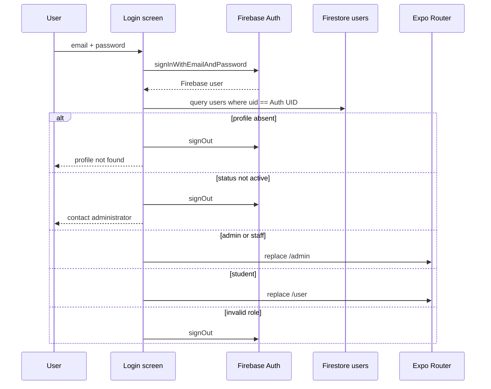

# 5. Authentication, authorization, storage, and security

## Authentication lifecycle

- **Sign-up:** no public sign-up. Administrative provisioning only.
- **Login:** Firebase email/password plus Firestore profile/status/role query.
- **Forgotten password:** `sendPasswordResetEmail`; enumeration-oriented messages differ by error code.
- **Email verification:** accounts are explicitly created with `emailVerified: false`; no verification send/check flow exists.
- **Session persistence:** `getAuth(app)` and `onAuthStateChanged`; no explicit RN AsyncStorage persistence initialization. Exact platform persistence is SDK-default and therefore not asserted.
- **Logout:** both Drawer layouts call Firebase `signOut` and replace `/`.
- **Profile/role loading:** `AuthContext` repeats the `uid` query. UsersContext separately subscribes to all users but filters admins from its returned list.
- **Protected routes:** admin screens use `AdminGuard`; user routes have no equivalent role/status guard.
- **Account approval:** no pending-account approval state. Accounts are created `active`.
- **Inactive/suspended:** login blocks any non-`active` profile. An already-authenticated session is not centrally ejected if status later changes.

## Firestore rules audit

### Current repository behavior

No Firestore rules file is tracked or referenced. Root `firebase.json` configures Hosting only; nested configs configure Functions only. Client code directly reads/writes all core collections.

### Security concern

Actual deployed rules cannot be determined. It would be unsafe to conclude either that the database is open or that it is correctly protected. The repository provides no auditable evidence for collection role checks, ownership checks, field validation, status transition validation, stock invariants, or destructive-operation restrictions. UI guards are not substitutes for rules.

## Storage/file handling

| Asset | Path strategy | Upload/delete behavior |
|---|---|---|
| Equipment image | `equipment-images/{equipmentId}/{timestamp}_{random}.jpg` | Client uploads blob and stores URL/path; edit deletes old image before replacement; delete is best effort |
| Student/self profile | `user-profiles/{uid}.jpg` | Client direct upload; old object deleted first |
| Function-created profile | `user-profiles/{uid}.{detectedExtension}` | Admin SDK saves up to the 10 MB JSON body limit, makes object public, stores public URL/path |

Client pickers restrict selection to images and request media permission, but there is no explicit maximum file size or server-verified content inspection in direct client uploads. The HTTP function guesses JPEG/PNG/GIF from base64 prefixes; otherwise defaults to JPEG. Profile objects created by the function are made public. Equipment download URLs are retained in documents. Storage rules are absent, so direct client upload/delete permissions are unknown.

Partial failure examples: a new equipment document can remain without an image; replacement can delete the old image before a failed upload; user deletion can remove Auth before Storage/Firestore cleanup fails.

## Security assessment

| Severity | Finding | Evidence and impact |
|---|---|---|
| Critical | Privileged HTTP user API has no authentication/authorization | `createUser/functions/src/index.ts` enables permissive CORS and exposes create, bulk create/delete, get, update, delete using Admin SDK without verifying an ID token or role. An external caller could administer accounts if the deployed function is reachable. |
| Critical | Data-plane authorization is unverifiable | No Firestore/Storage rule sources. Core clients directly mutate users, equipment, transactions, records, and objects. |
| High | Stock and transition integrity trust clients | Client code chooses IDs, users, statuses, prices, quantities, due dates, and mutations. No repository-visible server/rule invariant enforcement. |
| High | UI-only staff/admin equivalence is overly broad | Staff pass `AdminGuard` and can create admins, delete users/equipment/transactions, clear fines, and see all PII. |
| High | Direct-object access risks cannot be ruled out | Documents are addressed with predictable authenticated IDs/known Firestore IDs; ownership rules are absent. User route screens and direct APIs do not consistently validate role/ownership. |
| High | User images made publicly readable | Admin Function explicitly calls `makePublic`; profile PII link can outlive intended session controls. |
| Medium | Stored message HTML interpolates user/equipment text | Notification HTML and printable HTML are built without escaping. Delivery/printing can render injected markup if writes are not constrained. |
| Medium | PII is globally subscribed in clients | Admin providers load users, emails, phone numbers, courses; student layout also mounts UsersContext and receives every non-admin user document if rules allow. |
| Medium | Disabled sessions are not revoked by app state | `AuthContext` exposes status but guards do not check it after login. |
| Medium | No email verification requirement | Provisioned accounts remain unverified and login does not check verification. |
| Medium | Password spreadsheet workflow | Bulk import accepts plaintext initial passwords in Excel and sends them in one JSON request; handling/retention policy is not present. |
| Low | Distinct password-reset error messages | May reveal whether an email is registered, depending on Firebase email-enumeration protection. |

## Secrets/configuration finding

The tracked `firebase/firebaseConfig.js` contains literal Firebase web client configuration, including an API key. Firebase web configuration is commonly distributed to clients and is not equivalent to a service-account private key, but the audit brief classifies API keys as values not to reproduce. No service-account JSON, private key, access token, password, or SMTP credential was found in tracked first-party source. Environment variables are not used for the Firebase client or hardcoded function URLs.

## Input and destructive-operation controls

Forms validate basic email, Philippine mobile number, required text, positive quantities, and non-negative prices. Return UI prevents disposition totals above remaining quantity and requires notes for damaged/lost items. These are client/server-handler checks, not demonstrated security controls. Equipment deletion checks active transactions via a full client query; transaction and user deletion use confirmation dialogs. Account bulk deletion accepts an uploaded email list. There is no CSRF/origin allowlist, rate limiting, audit log, or re-authentication for destructive operations in the HTTP function.

