# 7. Borrowing workflow

## State machine

```mermaid
stateDiagram-v2
    [*] --> Request: student submits; stock reserved
    [*] --> Ongoing: staff/admin creates checkout; stock reserved
    Request --> Ongoing: staff/admin approves
    Request --> [*]: staff/admin denies; stock restored; document deleted
    Ongoing --> Ondue: due date becomes today
    Ongoing --> Overdue: due date passes
    Ongoing --> Incomplete: partial disposition
    Ondue --> Overdue: due date passes
    Ondue --> IncompleteAndOndue: partial disposition
    Incomplete --> IncompleteAndOndue: due date becomes today
    Incomplete --> IncompleteAndOverdue: due date passes
    IncompleteAndOndue --> IncompleteAndOverdue: due date passes
    Overdue --> IncompleteAndOverdue: partial disposition
    Ongoing --> ArchivedComplete: all quantities accounted
    Ondue --> ArchivedComplete: all quantities accounted before timestamp comparison says overdue
    Overdue --> ArchivedCompleteOverdue: all quantities accounted
    Incomplete --> ArchivedComplete: remaining quantities accounted
    IncompleteAndOndue --> ArchivedComplete: remaining quantities accounted before overdue
    IncompleteAndOverdue --> ArchivedCompleteOverdue: remaining quantities accounted
```

“Archived…” means a `records` document is created and the `transactions` document is deleted. There are no literal `ArchivedComplete` states. `Complete` and `Complete and Overdue` are the `records.finalStatus` values.

## Creation paths

### Student request

1. Student must be authenticated and resolvable through UsersContext.
2. On first submission, `agreedToTermsAndCondition` and `termsAcceptedAt` are written.
3. Cart must contain at least one item; due date must be today through seven days ahead.
4. Request screen queries globally available equipment and validates quantity against the local result.
5. It adds a `transactions` document with status `Request` and zero notification flags/fine.
6. It reads each equipment document and batches absolute available/borrowed count updates.
7. It calls manual maintenance; failure does not fail the request.

There is no student cancellation operation and no repository-visible per-user borrowing limit, outstanding-fine block, active-loan block, course restriction, or lab eligibility rule.

### Staff/admin direct checkout

The modal selects an active `student`, available equipment, quantities, and a due date. It writes the same shape with status `Ongoing`, reserves stock, and triggers maintenance. Unlike the student flow, the shown submission handler does not enforce the seven-day maximum.

## Approval and denial

| Transition | Actor | Conditions in code | Writes | Notification |
|---|---|---|---|---|
| `Request → Ongoing` | Staff/admin UI | Transaction exists; UI presents action only for Request | Status, new `borrowedDate`, reset flags, updated timestamp | Queues `transaction_approved` |
| `Request → deleted` | Staff/admin UI | Transaction exists | Restores all item counts and deletes request in one batch | Queues `transaction_denied` in same batch |

Approval does not recheck or change inventory. Denial has no persisted rejection record/reason. Both helper functions themselves lack an actor/role check.

## Due-state maintenance

The daily scheduled function runs at midnight `Asia/Manila`; an authenticated callable executes the same collection-wide routine. Active status is calculated from date and return quantities. The repository uses the nonstandard label `Ondue` for due today. Overdue fine is PHP 10 × calendar days overdue.

The server’s “some returned” test requires an item whose returned quantity is strictly between zero and borrowed quantity, while the client helper also considers any returned quantity. Both ignore damaged/lost quantities in status determination. These differences can yield inconsistent statuses. The server source also calls `batch.update` twice for the same maintenance update; the practical result is redundant mutation registration, not a second durable history event.

## Return processing

Staff/admin can submit quantities as good-returned, damaged, or lost, cumulatively. UI rules:

- processed total for an item cannot exceed its remaining borrowed quantity;
- damage/loss requires notes;
- “return all” marks all remaining as good.

Helper behavior:

1. Load the active transaction.
2. Add submitted values to cumulative item counts.
3. Decide completion when `returned + damaged + lost === borrowed` for every item.
4. Calculate overdue fine and full cumulative damage/loss fine (unit price × damaged/lost).
5. If incomplete, update embedded items/status/fine.
6. If complete, add a `records` snapshot, queue a receipt, optionally add a `fines` document, and schedule deletion of active transaction.
7. Update equipment: good returns increase available; all processed quantities reduce borrowed.
8. Commit the batch.

Important atomicity fact: the new `records`, receipt notification, and `fines` writes use standalone calls before the batch containing stock updates and transaction deletion commits. A later failure can leave duplicated/orphaned terminal artifacts while the active transaction remains.

## Manual deletion

For non-request active transactions, staff/admin UI offers Delete. The helper restores `quantity - returnedQuantity` and deletes the active transaction. It does not preserve a cancellation/audit record. It does not subtract damaged/lost quantities from “unreturned,” so deletion after partial damage/loss processing can restore stock incorrectly.

## Overdue, fines, and payment

- Overdue fine: PHP 10/day, derived in client and server code, not settings.
- Damage/loss: snapshotted `pricePerQuantity` per affected unit.
- Completed positive fines are duplicated into `records.fineAmount` and a separate `fines` document.
- Admin “pay all fines” queries a user's records, sets each positive `fineAmount` to zero, and sets `finePaidAt`. It does not set `finePaid` or update the separate `fines.status`, so the two representations diverge.

## Missing/uncertain lifecycle behavior

Not found: borrower cancellation, approval reason, rejection reason, checkout acknowledgment, pickup state, extension/renewal, lost-only closure policy, refunds/waivers, fine payment transaction, overdue escalation beyond one notice, immutable actor audit, or recovery/reconciliation tooling. Whether external rules/functions add constraints is unknown.

