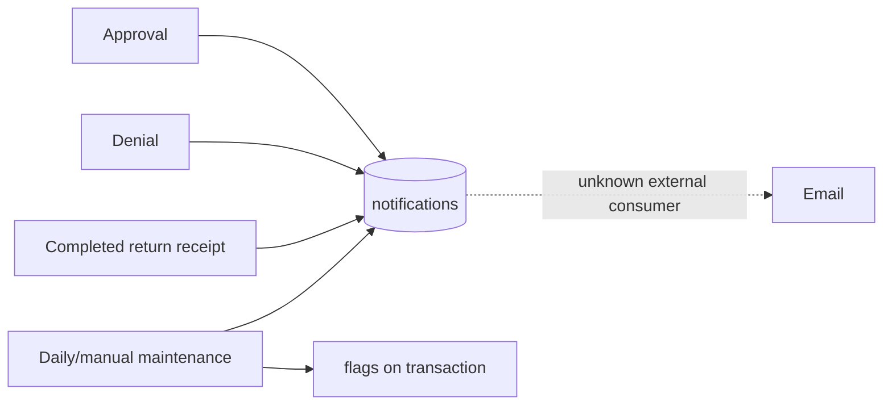

# 8. Notifications, history, and reporting

## Notification architecture

V1 produces Firestore documents containing recipient email and message bodies. It does not send email directly in the repository and contains no notification consumer. A deployed Firebase extension or separate service may watch `notifications`, but that cannot be determined.

## Notification types and triggers

| Type | Trigger | Recipient | Idempotency/lifecycle |
|---|---|---|---|
| `transaction_approved` | Staff/admin approves request | Transaction email/user ID | No approval-specific sent flag; one UI transition expected |
| `transaction_denied` | Staff/admin denies request | Transaction email/user ID | Queue write and request delete share batch |
| `transaction_receipt` | All borrowed quantities accounted for | Transaction email/user ID | Standalone write before final transaction batch |
| `return_reminder` | Active/incomplete transaction due tomorrow | Transaction email/user ID | `reminderNotified` checked then set in same batch |
| `ondue_notice` | Due-date range is today | Transaction email/user ID | `ondueNotified` checked then set |
| `overdue_notice` | Status overdue/incomplete-overdue | Transaction email/user ID | `overdueNotified` checked then set |

The scheduled job runs daily at midnight Manila time and calls status update, tomorrow reminder, overdue notice, and due-today notice in that order. Any authenticated user can invoke the equivalent callable. There is no in-app inbox, read/unread state, push token, Expo Notifications dependency, local notification scheduling, or notification-to-screen navigation.

## Notification scaling/consistency observations

- Status maintenance queries all transactions in six active statuses and updates them in one batch. Firestore batches have finite operation limits; no chunking exists.
- Each of three notice stages creates another single batch with no pagination/chunking.
- The due-today query combines a due-date range with `ondueNotified != true`; an index may be required, but no index file is tracked.
- Notification messages embed global “laboratory office,” PHP fine, and product wording with no department/lab template scope.
- The approval/receipt paths use the Firestore auto document ID or the display transaction ID inconsistently in message bodies and fields.
- There is no queue status handling in active writers, retry/dead-letter visibility, delivery receipt, bounce handling, or retention policy in this repository.
- User/equipment text is interpolated into HTML without escaping.

## History retention

Completed transactions are copied into `records`; active transactions are then deleted. The record retains copied user identity, item identity/name/value, dates, final status, return dispositions, total value, and fine. No code purges records.

This is snapshot history, not an audit trail:

- partial-return intermediate states are overwritten in the active transaction;
- approvals have no actor/timestamp separate from `updatedAt` and replaced `borrowedDate`;
- denial deletes the request;
- manual deletion deletes the active transaction;
- edits/deletions of users/equipment have no event log;
- fine clearing overwrites `record.fineAmount` with zero;
- notification documents may incidentally show some events but are not a complete, normalized audit record.

## Reporting surfaces

### Admin

`app/admin/reports.tsx` subscribes to all `records` through RecordsContext and computes all filtering/aggregation in memory. It provides:

- record list search by borrower name/email/display transaction ID;
- status and borrowed-date filters;
- equipment usage;
- monthly borrowing trends;
- return-status distribution;
- top borrowers;
- fine totals by month (“revenue” label, although payment is not established);
- peak borrowing weekdays;
- average borrowing duration;
- overdue rate;
- web print of detailed record results.

Admin inventory and borrower lists have separate web print views. No CSV/PDF server export or stored report artifact exists. `xlsx` is used for account administration, not transaction report export.

### Student

The dashboard shows active counts and record/fine summaries. The records screen filters the logged-in UID's history client-side by display ID, item name, status, and date. Because RecordsContext first downloads all records, this is presentation filtering rather than data-access scoping.

## Fine/history inconsistency

Reports derive fines from mutable `records.fineAmount`, while completion also writes an independent `fines` document that is never read. Clearing a record fine erases the report amount and does not update the fine ledger. Accordingly, “fine revenue,” outstanding balance, and payment history are not reliable accounting facts without external data behavior not present in the repository.

