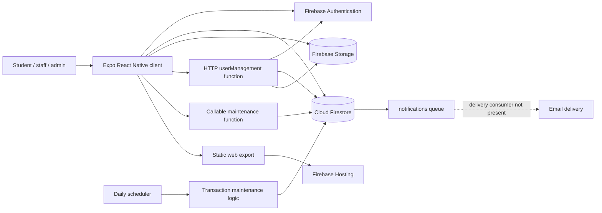

# eLabTrack V1 technical audit

**Audit date:** 2026-10-04  
**Scope:** the repository at the audited revision; static inspection only  
**Purpose:** establish a factual baseline for later V2 requirements and domain design

## Reading conventions

- **Fact** means behavior or structure directly evidenced by the repository.
- **Observation** is an engineering implication derived from those facts.
- **Unknown** means the repository is insufficient to establish the deployed behavior.
- Paths are repository-relative. No deployed Firebase console state or live data was inspected.
- Credential values are intentionally omitted. The repository contains committed Firebase client configuration; values are not reproduced here.

## Documents

| Document | Coverage |
|---|---|
| [01-system-overview.md](01-system-overview.md) | Product, architecture, stack, actors, major flows |
| [02-repository-architecture.md](02-repository-architecture.md) | Repository map, entry points, state, errors, testing |
| [03-navigation-and-user-roles.md](03-navigation-and-user-roles.md) | Route tree, role/permission matrix, UI authorization |
| [04-data-model.md](04-data-model.md) | Reverse-engineered Firestore schema and relationships |
| [05-authentication-and-security.md](05-authentication-and-security.md) | Authentication, rules evidence, storage, security assessment |
| [06-equipment-domain.md](06-equipment-domain.md) | Equipment model, discovery, inventory consistency |
| [07-borrowing-workflow.md](07-borrowing-workflow.md) | Request-to-return state machine and write effects |
| [08-notifications-and-history.md](08-notifications-and-history.md) | Notification queue, maintenance jobs, history, reporting |
| [09-business-rules.md](09-business-rules.md) | Extracted rules and enforcement locations |
| [10-scalability-audit.md](10-scalability-audit.md) | Evidence-based campus-scale constraints and V1 assumptions |
| [11-technical-debt.md](11-technical-debt.md) | Debt register and maintainability assessment |
| [12-dependencies-and-deployment.md](12-dependencies-and-deployment.md) | Dependencies, environments, build and deployment |
| [13-feature-matrix.md](13-feature-matrix.md) | Factual V1 feature matrix |
| [14-v2-planning-observations.md](14-v2-planning-observations.md) | Migration facts and final audit summary |

## Scope boundaries and important unknowns

The repository has no Firestore rules file, Storage rules file, Firestore index definition, EAS configuration, CI workflow, or environment-specific configuration. The root `firebase.json` configures only Hosting. Consequently, deployed database/storage permissions, deployed indexes, mail-delivery configuration, Firebase extensions, production build profiles, and production-versus-development isolation cannot be determined here.

No live Firebase data was sampled. Field optionality is therefore based on constructors, readers, defaults, and update sites—not empirical document completeness. No offensive testing or endpoint invocation was performed.

## High-level architecture

## Audit conclusion at a glance

V1 is a client-heavy, Firebase-backed Expo application for a globally shared laboratory inventory. Students browse aggregate equipment stock, submit approval requests, view active/history records, and edit profiles. Staff and admins share the same operational interface for requests, checkout creation, returns, inventory, borrowers, reports, and user administration. Two Cloud Functions projects provide privileged user lifecycle operations and scheduled status/reminder processing.

The most consequential findings are: unauthenticated privileged HTTP user-management endpoints; absent rule sources in the repository; unbounded global real-time reads; UI-coupled authorization and business logic; non-transactional stock read/modify/write operations; no organization/lab scope; and split, partially inconsistent representations for active transactions, archived records, fines, and notification messages.

## Validation results

Validation was performed without changing application source:

| Check | Result |
|---|---|
| Expected Markdown files and README targets | Pass: all 15 files exist and index targets resolve |
| Markdown fences / Mermaid presence | Pass: balanced fences; six Mermaid diagrams inspected for reasonable syntax |
| Documentation credential-pattern scan | Pass: no credential values detected |
| Root TypeScript (`tsc --noEmit`) | **Fails on pre-existing source errors:** admin return callback shape; four Chart Kit calls missing required `yAxisSuffix`; Gluestack bottom-sheet/table ref typing |
| Root Expo web export | Pass: 14 static routes exported |
| `createUser` Functions build | Pass |
| `createUser` Functions lint | Pass with four unused-variable warnings |
| `overdueChecker` Functions build | Pass |
| `overdueChecker` Functions lint | Pass with one explicit-`any` warning |

The application errors were not repaired because the audit explicitly prohibits behavior/source changes. The build regenerated only ignored `dist` content; final Git status contains only the new documentation directory.
