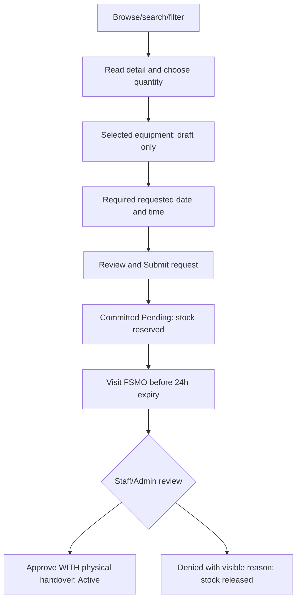

# Borrower flows — mobile first

**Binding Phase11 selection overlay,2026-10-10:** [DEC-080 specification](PHASE11_EQUIPMENT_SELECTION_UX.md) requires actual catalog imagery/name/category/available physical quantity on each selection card and mobile `[ − ] [ quantity ] [ + ] [ Add ]` in one row with adequate touch targets. Mobile review uses a sheet or dedicated screen; desktop shows V1-inspired browsing and cart together. Phase7 contracts govern; Add remains local draft intent without prices/payments. Both owner V1 screenshots are received and inspected in the specification; future rendered/runtime comparison remains pending and implementation remains paused under DEC-081. Conflicting historical control placement is superseded; other business rules are unchanged.

**Current provisioning policy overlay, 2026-10-08:** [DEC-070 / approved rules and remaining gates](../project/ACCOUNT_PROVISIONING_POLICY.md) governs future behavior: only Admin creates accounts; Student requires unique textual official Student ID/approved SKSU email; Faculty is individual-only with valid unique accessible email and no required Student ID. Standard bulk creation/deactivation is Student-only. Both use borrower-owned separate passwords and current officially published Phase4B terms. This documentation overlay changes no implementation or approved mockup asset; original phase checkpoints remain historical.

Phase 3A.1 low-fidelity proposals, 2026-10-08; no implementation/high-fidelity styling. [Architecture/inventory](UX_ARCHITECTURE.md) IDs B-01–22, [wireframes](WIREFRAMES.md) WF-01–14/37 and [status labels](STATUS_SYSTEM.md). Student/Faculty share one Borrower experience. Working policy remains [Phase 2.5 rules](../domain/BUSINESS_RULES.md).

## Sign in and terms

SH-01 → authenticated Borrower → B-01 if current version not accepted → review version/content → accept once → B-02. No public signup, authorization-role selector, device handoff or assumed new password-reset service. DEC-070 secure activation precedes normal login when implemented: both categories choose separate eLabTrack passwords; Student receives the recommended single-use link at approved institutional email, Faculty at valid accessible email including non-institutional addresses. Brevo is selected for backend-only activation and future password recovery (DEC-071); integration/configured API key/verified sender/successful live testing and ownership/recovery lifecycle remain dependencies. No new recovery UI/endpoint or real delivery is claimed. Both require current officially published terms; missing/unapproved text cannot produce official acceptance. DEC-072 finalizes official wording after FSMO presentation without blocking independent account-management/inventory development; live borrowing still enforces official publication and documented acceptance. “Need an account? Contact FSMO” explains provisioned access. Authentication errors remain safe; account inactivity uses SH-02 without showing private cached history.

First-use landing introduces terms; acceptance is required to submit a request, not repeated on every request. Existing terms become stale when a material version changes: show “Review updated terms before your next request” and link B-01. Borrower can still view existing loans/history/account information; pending submission retains its version. Never use a global terms dialog that hides existing obligations. Terms display full readable content, version/effective date, accessible consent control and Accept terms; Cancel/back does not accept. On acceptance failure remain with clear retry and no false accepted state. At submit-version conflict preserve cart/date, review latest terms, then review and submit deliberately. Staff cannot accept for Borrower.

## Journey A — browse, request, visit FSMO, receive equipment

| Step | Surface / action | Visible information and boundary |
|---|---|---|
| 1 | B-02 Home → B-03 Equipment | Catalog is Interactive Kiosk; navigation mobile first |
| 2 | B-03/04 search/filter → B-05 detail | Name/catalog image/category if present/short description/current available count; no R/C/damage/loss buckets |
| 3 | Choose quantity → Add to request → B-06 | Positive integer <= latest shown availability; cart unique item; draft not a hold; no purchase/value total |
| 4 | Edit/remove selected items | Preserve query/back state; no excessive confirmation for local change |
| 5 | B-08 choose due date AND time → B-07 review | Required requested instant labeled Asia/Manila; no date-only or seven-day maximum; Staff confirms final deadline at release |
| 6 | Review items/due/terms version, tap Submit request | “Reserved after submission; visit FSMO for approval and release. Pending request expires24h after submission.” No per-loan accept checkbox for already current terms |
| 7 | Success B-09 and B-10 only after commit | Reference, PENDING, reserved quantities, server submission/expiry, requested due; full next step below |
| 8 | Borrower physically visits Staff/Admin | No digital approval button for Borrower; Staff reviews fine/context in person, may approve or deny |
| 9 | Staff approves WHILE handover → B-14 | Active (CHECKED_OUT) with issued quantities/final due; approval and release one event, no persistent Approved stage |

Submitted copy: **“Your equipment is reserved. Visit FSMO for approval and physical release before [expiry date/time, Asia/Manila]. This request is not yet approved.”** Primary View request; secondary Browse equipment; no directions/address/contact invented. Old overdue fine does not block steps1–7; outstanding accountability may be shown as information, never a mandatory Pay gate.

Catalog unavailable quantity: display Out of stock / Currently unavailable and disabled Add to request with explanation. Inactive/archived pools cannot be selected. Cached quantity is not a guaranteed reservation: submit conflict refreshes affected lines, explains available quantities and requires review/edit/resubmit. No silently reduced request or stock mutation in client.

## Pending, own cancellation and Journey B — expiry

B-10 shows Pending, reservation list, requested due, submitted_at, absolute expires_at and advisory time remaining. Selected equipment is reserved **for this request**; no future editing after submission. Action Cancel request appears only for own unexpired PENDING; confirmation says “Reserved equipment will be released. This request stays in your history.” Back/Keep request safe; server success shows B-13 Cancelled. Borrower cannot cancel issued/denied/expired/completed rows. If staff processed it during confirmation, show actual authoritative state and do not release locally.

Journey B: pending request not acted on →24h deadline → display elapsed/checking while server status refreshes → confirmed B-12 Expired, released reservation/history retained → Start a new request. New request rebuilds a draft with current availability/terms/new due; does not reactivate old transaction. Client countdown never asserts inventory release or becomes persisted lifecycle. Expired is distinct from Denied (no denial reason/accusation), and from Cancelled (user action). Expiry history timestamps remain; overdue fines never accrue for PENDING/EXPIRED.

B-11 Denied shows required visible reason and decision time, equipment and requested due for context, Start a new request. No unnecessary internal operator identity/audit note. New request requires fresh stock/terms checks; a denied-for-fine reason is a human operational decision, not proof all future submissions are blocked.

## Active loan, Journey D — normal full return

B-14 shows reference/Active, equipment issued and physically outstanding, final due date/time, read-only accountability and “Bring the equipment to FSMO; Staff/Admin records the return.” Borrower approaches Staff/Admin; Staff records good quantities; B-18 becomes Completed only after all physical/replacement0. End time freezes final overdue fine; no fine may show “No overdue fine”. A monetary Outstanding fine can coexist with Completed.

Borrower has no Mark Returned, complete, evidence, camera or upload control. A personal phone photo may be physically shown in the real-world interaction but never enters eLabTrack; no UX step, form field, notification media or attachment record for any role. Catalog images are independent.

## Journey E — partial return, then final return

Issue5 spoons → Staff records good2 → B-15 shows issued5/good2/damage0/loss0/physically outstanding3/replacement0, Active + Partial return. Original due remains. Read-only event rows show quantities/time, no editable checkbox. Later staff good3 → physical0/replacement0 → Completed and frozen fine. The success screen or toast alone is not completion evidence; borrower detail follows current server state.

At narrow width item cards use labels for each value, never a wide spreadsheet. Return history progressive disclosure follows remaining obligations, not before them. Tablet/desktop may show aligned summary columns without different actions.

## Journey F — loss and accepted replacement

Issue5 → Staff records good2/loss3 → B-16 shows physical remaining 0, “Replacement required: spoons3, Lost”, required3/accepted0/remaining 3. Loan still Active despite no physically outstanding units. No peso equipment-price charge and no phantom checked-out3. “Bring3 appropriate replacements to FSMO for Staff/Admin acceptance.” Equivalence at operational discretion, no borrower automatic substitution approval.

If staff accepts1 replacement, accepted1/remaining 2 and loan stays open. Later accepts2 → remaining 0/all physical0 → Completed; historical Lost3 incident remains alongside accepted replacement events. Damage case follows same liability flow; damaged originals are nonusable stock held by FSMO, not borrower loan quantity. Borrower does not manage original disposition/repair.

## Journey G — overdue, growing fine, completion, Admin full clear

Original due crosses while physical or replacement remains → B-17 “Overdue”, due/remaining quantities and live PHP fine/as-of. At1min PHP 10; exactly 24h PHP 10;25h PHP 20. Copy: “This fine can increase until all equipment and replacements are resolved.” Visit/contact FSMO, no gateway/partial-payment control.

Final authoritative return/replacement at due+25h → B-18 Completed, final PHP 20 frozen, Fine outstanding20. Admin later records PAID/WAIVED/OTHER_RESOLUTION full clear20 → Fine cleared, final assessed20/history/time/method still visible. Do not label waived amount as payment. Owner-visible history may show operational resolution label/date without private Admin note/PII. An active loan cleared10 can later accrue another10; explain live assessment20 / previously cleared10 / outstanding10. No “Cleared forever” promise before operational completion, no paid fine pretending replacement resolved.

## My Borrowings, history, notifications and account

B-19 primary tabs Pending / Active / History. Card hierarchy reference/status, equipment summary, due or expiry, highest-priority derived badge, Open detail. B-20 historical filters All / Completed / Denied / Cancelled / Expired; Completed may show Fine outstanding. Server paging with a labeled Load more or pagination, not global downloads. Empty history suggests Browse equipment; history never deletes old requests.

B-21 notification/activity rows link to own canonical detail; cover submit, deny, approve/release, expiry, due reminder, overdue, partial, replacement created/resolved, complete. Show event time and message preview; no fictional delivery claim, persistent unread count, read receipt or mark-all-read. Owner-scoped event projection/API remains later feature design; this is a requested UX concept, not new inbox schema. If delivery details unavailable, use “Update” wording; pending email is not missing authoritative state.

B-22 shows own name/email/category/program/contact where approved, active account status, terms version, theme toggle, sign out. Only supported approved profile fields editable (current display name is foundation behavior; email/category/role/status read-only). No deactivate, fine clear, Staff management or software return-evidence option. Provide FSMO contact instruction for provisioned account changes without inventing a contact address or password onboarding mechanism.

## State and interaction acceptance

| State | Borrower response |
|---|---|
| No equipment | Explain catalog empty; Retry if load failed, otherwise contact FSMO / return Home |
| No matches | Clear filters / edit search; preserve cart |
| Empty cart | Browse equipment primary; no enabled submit |
| No pending/active/history | Accurate empty message and Browse equipment, not count0 from loading |
| No replacement/fine | “No replacements required” / “No overdue fine”; no acceptance/payment implication |
| Read failure | Region Alert/Retry with preserved context; show unavailable amount instead of fabricated0 |
| Submit timeout | Check original result before resubmitting; no false success/reservation |
| Terms/quantity/due validation | Associate field errors, focus summary, keep input |
| Concurrent decision/expiry | Show actual state, remove obsolete Cancel; no local terminal guess |
| Reauthentication/authorization | Follow existing session behavior; private data hidden; safe return destination after fresh authorization |

All actions remain keyboard-accessible and status text meaningful without color. Exact responsive behavior is in [RESPONSIVE_RULES](RESPONSIVE_RULES.md); future implementation checks stay unchecked in [checklist](UX_ACCEPTANCE_CHECKLIST.md).
