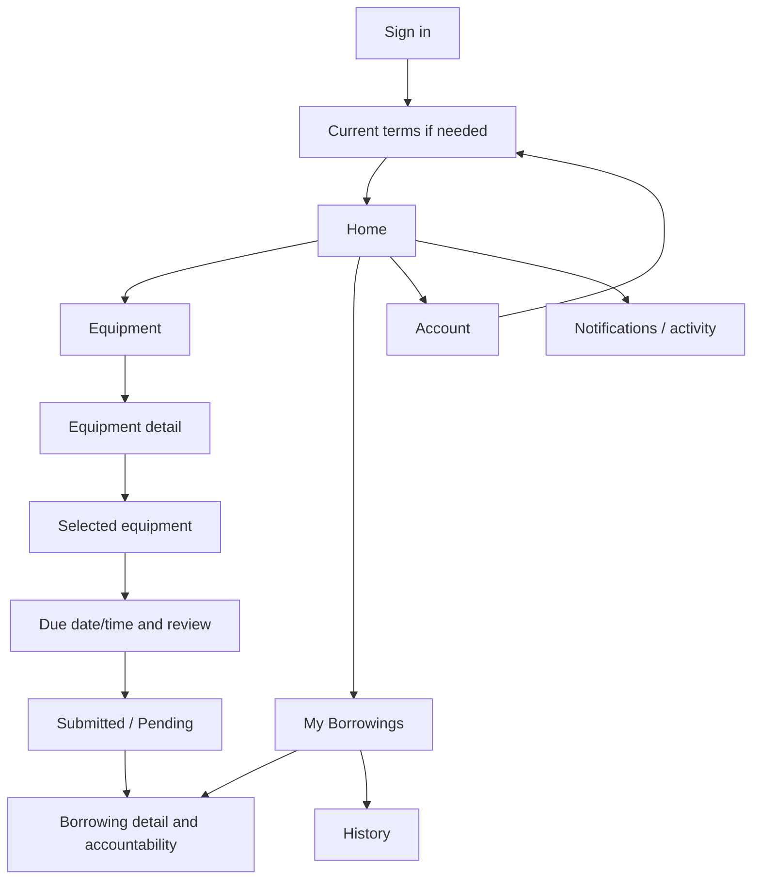
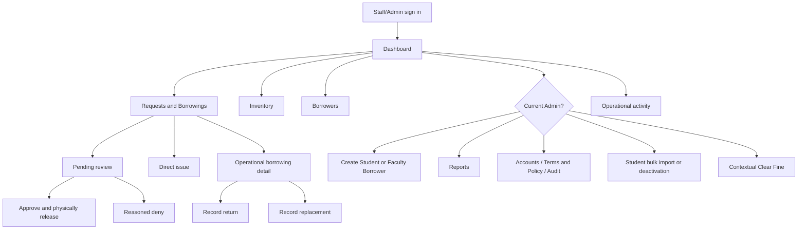

# UX architecture — Phase 3A.1

**Current provisioning policy overlay, 2026-10-08:** [DEC-070 / approved rules and remaining gates](../project/ACCOUNT_PROVISIONING_POLICY.md) governs future behavior: only Admin creates accounts; Student requires unique textual official Student ID/approved SKSU email; Faculty is individual-only with valid unique accessible email and no required Student ID. Standard bulk creation/deactivation is Student-only. Both use borrower-owned separate passwords and current officially published Phase4B terms. This documentation overlay changes no implementation or approved mockup asset; original phase checkpoints remain historical.

**Low-fidelity design draft delivered, 2026-10-08.** Current authorized phase: Phase 3A.1 only. These are UX proposals for review, not implemented routes/components, approved visual styling or changes to working policy. Phase 3A.2 high-fidelity design and Phase 3B implementation remain unstarted. [Phase report](../project/PHASE3A1_REPORT.md) records the gate.

## Authority and scope

[Phase 2.5 rules](../domain/BUSINESS_RULES.md), [state machine](../domain/STATE_MACHINES.md), [arithmetic](../domain/DOMAIN_MODEL.md), [schema](../domain/DATA_MODEL.md), [invariants](../domain/INVARIANTS.md), [API draft](../domain/API_RESOURCE_DRAFT.md) and [source policy](../project/SOURCE_OF_TRUTH.md) govern. Current owner instructions override older charter/Phase 2 alternatives. V1 audits/capstone are historical intent/implementation evidence, not permission to add product policy. No tenancy/campus hierarchy, native app, hardware kiosk, separate eligibility, online payment or return-photo feature.

| Role | Primary task | Navigation / authority |
|---|---|---|
| BORROWER | Find equipment, request reservation, visit FSMO, follow own obligations/history | Mobile first; own records; no authoritative return/acceptance/clear controls |
| STAFF | Operate face-to-face issue/returns/replacements, catalog stock and borrower assistance | Desktop/tablet first; operational history/fine viewing; cannot create any account, clear fine, deactivate/import or manage privileged accounts |
| ADMIN | All Staff operations plus individual Student/Faculty creation and privileged administration | Named accounts; all account creation, Student-only bulk creation/deactivation, Staff-Admin management, fine clearing, exceptional corrections, terms/policy/audit/reports |

Student/Faculty share Borrower navigation and are categories, not roles; individual Admin creation has conditional Student-ID/email fields. Phase4A implements BORROWER/STAFF/ADMIN; provisioning/category storage remains unimplemented. Future server permissions follow DEC-070 while retaining Phase1/4A session/security. Client navigation is permission-aware presentation; server authorization remains decisive.

## Navigation architecture

Borrower mobile: compact app bar (title/back, Notifications with accessible name, selected-equipment count when relevant), **four labeled bottom destinations: Home, Equipment, My Borrowings, Account**. Four avoids crowding; catalog and loan follow-up are direct. Notifications is a secondary top-bar/account destination rather than a fifth crowded tab. No mobile sidebar as base. Cart is a contextual catalog destination with quantity count, not a global primary tab. Selected-equipment draft is account-scoped intent; reservation begins only after submission.

At tablet keep bottom navigation and expand content. At desktop replace it with persistent compact side navigation carrying the same four labels and Notifications secondary link; catalog/request can show a side summary. This is one workflow with more space, no second borrower product. Deep links keep active destination and parent/back behavior; browser back restores filters/scroll and unsent local form where safe, without resurrecting another user's data.

Staff/Admin: one-level sidebar **Dashboard, Requests & Borrowings, Inventory, Borrowers**. Requests & Borrowings contains horizontal tabs Pending / Active / Overdue / Replacements / History, not five sidebar nests. Admin adds **Reports, Administration**; Administration has Accounts / Terms & Policy / Audit. Admin Clear Fine appears contextually on borrower/borrowing fine panels, Student-only bulk import/deactivation and Admin-only individual creation on Borrowers, not hidden in generic settings. Operational Notifications and signed-in identity/theme/sign-out in app bar/account menu. Staff gets operational filtered views, not administrative exports/reports/audit. Admin uses the same operational shell, no mode switch that changes authority.

Pending→detail here denotes navigation, not an assumed approved lifecycle transition; Staff/Admin physically releases via the domain command. Terms acceptance gates new requests, not access to existing obligations.

## Screen inventory and counting rule

**59 reviewable UX surfaces = 2 shared + 22 Borrower + 22 Staff/Admin operational + 13 Admin-only.** This includes pages, steps, sheets/dialogs, detail variants and sections; it is not 59 separate routes. Lifecycle variants share one canonical borrowing detail. Admin inherits the 22 operational surfaces; O-17 retains its ID but is now Admin-only under DEC-070; do not count them twice. All 59 map to38 numbered [wireframe groups](WIREFRAMES.md), with shared/variant layouts explicitly noted. Page locations/labels are design navigation concepts, not changes to the current router.

### Shared access — 2

| ID | Surface | Representation | Wireframe group | Purpose / permission |
|---|---|---|---|---|
| SH-01 | Sign in | Page | WF-01 | Provisioned-account access; no signup |
| SH-02 | Access/session recovery | State | WF-37 | Expired session, inactive account, forbidden or absent resource |

### Borrower inventory — 22

| ID | Surface | Representation | Wireframe group | Purpose / permission |
|---|---|---|---|---|
| B-01 | First-use / updated terms | Page | WF-02 | Own current-version acceptance; existing history accessible |
| B-02 | Home | Page | WF-03 | Next action, pending/active/accountability summaries |
| B-03 | Equipment catalog | Page | WF-04 | Browse and available quantities, no physical bucket exposure |
| B-04 | Search / filters | Sheet | WF-04 | Query/category/available filter; taxonomy draft |
| B-05 | Equipment detail | Page | WF-05 | Description/catalog image/quantity/Add to request |
| B-06 | Selected equipment / cart | Page | WF-06 | Unique items, quantity edit/remove; not reserved yet |
| B-07 | Request review | Page | WF-07 | Confirm items/due/current terms and physical visit |
| B-08 | Due date / time selection | Step | WF-07 | Required requested date+time, Asia/Manila; no seven-day cap |
| B-09 | Request submitted | State | WF-08 | Committed PENDING/reservation and visit FSMO instruction |
| B-10 | Pending request detail | Variant | WF-08 | Own hold/absolute expiry/requested due/confirmed cancel |
| B-11 | Denied request detail | Variant | WF-09 | Required visible reason, decision time, retained history |
| B-12 | Expired request detail | Variant | WF-09 | Released hold after confirmed expiry; new request |
| B-13 | Cancelled request detail | Variant | WF-09 | Retained cancellation and release; no deletion |
| B-14 | Active borrowing detail | Page | WF-10 | Issued date/due/items/return instructions |
| B-15 | Partial return status | Section | WF-11 | Read-only good/damage/loss/physical remaining |
| B-16 | Replacement status | Section | WF-11 | Required/accepted/remaining by incident; visit FSMO |
| B-17 | Overdue / fine status | Section | WF-10 | Live/final assessment and unresolved quantities; no Pay button |
| B-18 | Completed borrowing detail | Variant | WF-11 | Physical0/replacement0, frozen final fine and clearance history |
| B-19 | My Borrowings overview | Page | WF-12 | Pending/active list; primary destination |
| B-20 | Borrowing history | Page | WF-12 | Completed/denied/cancelled/expired list, cards on mobile |
| B-21 | Notifications / activity | Page | WF-14 | Own relevant event display; delivery/read state not invented |
| B-22 | Profile / account | Page | WF-13 | Identity/category/read-only status, theme, terms, sign out |

### Operational inventory — 22 plus original O-17 now Admin-only

| ID | Surface | Representation | Wireframe group | Purpose / permission |
|---|---|---|---|---|
| O-01 | Operational dashboard | Page | WF-15 | Actionable pending/active/due/overdue/replacement queues |
| O-02 | Pending request queue | Page | WF-16 | Open review before approve; expiry/accountability indicators |
| O-03 | Request review | Page | WF-17 | Identity/active/terms/held quantities/due, approve WITH handover |
| O-04 | Denial reason / confirmation | Dialog | WF-18 | Required borrower-visible reason; release/history |
| O-05 | Borrowings list | Page | WF-38 | Active/overdue/replacement/history filters, bounded |
| O-06 | Operational borrowing detail | Page | WF-38 | Physical/replacement/fine/event panels and safe actions |
| O-07 | Direct issue: select Borrower | Step | WF-19 | Active existing Borrower, current terms evidence |
| O-08 | Direct issue: select equipment | Step | WF-19 | Unique quantities/current available stock |
| O-09 | Direct issue: due date/time | Step | WF-19 | Required future due date+time, Asia/Manila |
| O-10 | Direct issue: review / handover | Step | WF-19 | Confirm immediate checked-out issue; no pending |
| O-11 | Return processing | Page | WF-20 | Unique quantities, full-good shortcut, good/damage/loss now |
| O-12 | Return review / result | State | WF-21 | Exact stock/liability/open-or-complete summary |
| O-13 | Replacement selection | Page | WF-22 | Obligation/accepted quantity/type/equivalence |
| O-14 | Replacement review / result | State | WF-22 | Acquisition and remaining/complete; no overacceptance |
| O-15 | Borrower list | Page | WF-23 | Search/category/status; generic Borrower |
| O-16 | Borrower detail | Page | WF-24 | Operational account/history/fine/current obligations |
| O-17 | Admin individual Student/Faculty creation | Page | WF-25 | ADMIN-only even within this original operational grouping; BORROWER fixed; Student required string ID/SKSU email, Faculty accessible email/no required ID; borrower-owned activation |
| O-18 | Inventory list | Page | WF-26 | A/R/C/damaged_held/total plus separate liability |
| O-19 | Inventory detail / movements | Page | WF-27 | Physical counts separate from incidents, readable ledger |
| O-20 | Equipment create / edit | Page | WF-28 | Metadata/version/catalog image; no raw stock override |
| O-21 | Ordinary stock movement | Dialog | WF-29 | Typed usable add/remove with reason; no R/C edit |
| O-22 | Inactive / archive confirmation | Dialog | WF-29 | No holds/physical/replacement for archive; keep history |
| O-23 | Operational notifications | Page | WF-14 | Scoped activity/status; no provider settings or inbox administration |

### Admin-only inventory — 12 original surfaces plus O-17

| ID | Surface | Representation | Wireframe group | Purpose / permission |
|---|---|---|---|---|
| A-01 | Clear Fine | Dialog | WF-30 | Full outstanding only, method/note/confirmation |
| A-02 | Fine clearance history | Section | WF-30 | Original/live/final and PAID/WAIVED/OTHER distinct |
| A-03 | Student Excel template / file | Step | WF-31 | Admin-only; studentId/name/email/course/contactNumber; no password or role/category assignment |
| A-04 | Student bulk validate / complete preview | Step | WF-31 | Student ID/SKSU email required; valid/invalid/duplicate/conflicting identities; explicit confirmed subset, Faculty/privileged conflicts reject |
| A-05 | Bulk import result | State | WF-31 | Created/rejected/unknown outcomes; no blind resend |
| A-06 | Deactivate / reactivate Borrower | Dialog | WF-32 | Impact/history confirmation, no loan erase |
| A-07 | Staff/Admin accounts | Page | WF-33 | Named privileged users; Admin-only access |
| A-08 | Create / edit Staff/Admin | Page | WF-33 | Role/status review; last-admin/recovery dependency |
| A-09 | Settings / current terms and policy | Page | WF-34 | Typed current values; TTL/fine read-only until config approved |
| A-10 | Terms version draft / publish review | Page | WF-34 | Approved copy/version/new requests gate; preserve history |
| A-11 | Administrative reports | Page | WF-35 | Filters/results/export concept; approved formats later |
| A-12 | Administrative audit | Page | WF-36 | Restricted bounded who/what/when/source, no secrets |

## Information hierarchy and interaction boundaries

Borrower: next real-world action → lifecycle/time → equipment/quantities → physical and replacement remaining → current/final overdue fine → historical events. Show “Visit FSMO for approval and release” immediately after submission. A hold is not approval. Fine is read-only with visit/contact instruction; no checkout payment vocabulary. Denial reason visible, named internal operator not needed in borrower list. Operational labels use reference rather than UUID; fabricated examples contain no real user/contact data.

Staff: identity/category/active status → request deadline and accepted terms evidence → held quantities/due confirmation → accountability context → decision/handover. Returns show physical remaining separately from replacement remaining; fine does not decide operational completion. Inventory uses actual four physical counts plus separate historical incident/liability summaries; do not sum them together.

Structured Staff/Admin return condition/quantity/notes, stock movements and audit remain system records. Personally shown phone photographs stay completely outside eLabTrack: no camera, upload, transmission, storage, retention, attachment or evidence-step control for any role. Independent equipment catalog images remain supported; their approved storage and image-content checks belong to later implementation.

## State, loading, error and conflict strategy

| Situation | Designed response | Boundary |
|---|---|---|
| Initial read | Region-shaped Skeletons for cards/rows/detail; retain navigation/title | Do not show zero counts as loaded truth |
| Background refresh | Keep prior snapshot with “Updating”; show last checked/as-of | Disable authority-sensitive submit until a usable current response; do not overwrite local input silently |
| Empty domain | Helpful next action: browse/create/request/view history appropriate to role | Empty cart/queue is not loading/error |
| Empty filtered result | Explain filters; Clear filters retains unrelated draft | Do not imply no equipment exists |
| Network failure | Inline Alert and Retry for reads; preserved account-scoped intent | No offline issuance or optimistic stock reservation |
| Field validation | Summary + linked inline errors; focus first invalid field | Requested quantity/date/time/required reason/type/method; no raw API error |
| Stock changed | Explain unavailable quantities; refresh only affected lines, review edits before resubmit | No silent smaller request or new-key retry of unknown write |
| Staff state conflict | “This request was already processed” / “Quantities changed”; refresh authoritative summary | Keep entered quantities separate; require revised review, never autoapply stale return |
| Pending expiry while open | Countdown is advisory; “Reservation time elapsed; checking status” until server EXPIRED | Do not claim stock released from client timer alone |
| Unexpected failure | Action failed/uncertain distinction, safe Retry/check-status; expandable request ID for support | No provider/SQL/body/credential detail; support ID not a business reference |
|401 / inactive account403| Existing foundation reauthentication/current-account behavior, then access-recovery view | Clear private view/drafts under existing session fences; no changing Phase 1 cookie/rotation rules |
| Ordinary operation403 /404| Explain unavailable action/resource, safe back navigation | Do not log out all tabs or leak other users' existence |
| Unknown mutating result | “Checking whether this was recorded”; reconcile original command/result before another submit | Double-tap disabled, original-key safe retry later; no arbitrary auto retry |

TanStack Query will own server data through feature hooks/API/central transport; appropriate Zustand or local React owns account-scoped cart/UI state, React Hook Form+Zod forms. No storage of session credentials or private drafts is introduced. Future private queries/mutation replies participate in existing Phase 1I classification/generation fences. Sidebar/route guards do not confer authority. No changes to existing Query/session code in this phase.

## Explicit empty-state inventory

| Empty state | Message / next action | Roles |
|---|---|---|
| No equipment in catalog | No equipment is currently listed; return Home/contact FSMO | Borrower; Staff/Admin inventory has Add equipment |
| No search matches | No equipment matches these filters; Clear filters / edit search | All permitted catalog users |
| Empty selected equipment | Nothing selected; Browse equipment | Borrower / direct issue equipment step |
| No pending requests | No requests waiting for review; Browse equipment or Direct checkout respectively | Borrower / Staff/Admin |
| No active borrowing | No active borrowings; Browse equipment / view historical records | Borrower; Staff/Admin View all borrowings |
| No history | No historical transactions yet; Browse equipment / clear filters | Borrower / Staff/Admin permitted history |
| No overdue borrowings | No overdue borrowings in this view; View active borrowings / Clear filters | Staff/Admin; Borrower has no overdue warning when false |
| No replacement obligation | No replacements required; view borrowing or remaining physical units | Owner Borrower / Staff/Admin |
| No Borrowers | No Borrower accounts match or exist; Clear filters; Admin may Create Student/Faculty | Staff/Admin operational view; any creation and Student bulk operations Admin-only |
| No report results | No results for selected range/filters; adjust range / Clear filters | Admin |
| No notification/activity updates | No updates for this view; view relevant borrowings | Owner Borrower / Staff/Admin operational view |

Empty versus network/permission/error is explicit; never offer a forbidden creation/export action. All major screens use the same loading/error strategies and their own contextual empty content.

## Confirmation and action rules

Confirm own pending cancellation (hold released/history remains), denial (required visible reason), approval/direct issue (physical handover now), authoritative return/replacement summary, Admin deactivation/reactivation, stock removal/correction/archive and full fine clearance. Harmless filter, quantity draft edit and single cart removal use immediate local action/undo where sensible; do not prompt for every tap. Closing an unsaved material form offers Keep editing / Discard draft. Unsaved return draft is not a return event.

Critical summaries show exact items/quantities and resulting physical/replacement/stock/fine implications. No generic Complete, borrower Mark Returned, Pay Online, partial payment, staff Clear Fine or destructive borrowing Delete. Administrative pending cancellation is still unselected and has no current wireframe action.

## Existing UI evidence and shadcn mapping principles

Read-only source: `frontend/src/app/{App,router,providers,query-client,session-bootstrap}.tsx/ts`, foundation pages, ui-store, use-mobile, components.json and ui inventory. Actual router has only `/`, `/status`, wildcard; actual page is foundation/status, not a product shell. **62 ui TSX files**, Base UI shadcn base-nova, Lucide, Tailwind v4 are present. Existing theme store supports light/dark; use-mobile threshold768px. Design uses that mobile/tablet boundary and proposes1024px desktop, without changing code. Existing Sidebar is appropriate later for operational/desktop layouts, not forced onto borrower mobile. Attachment/chat/showcase primitives in the inventory do not authorize features.

Use available Button/Card/Badge/Input/Field/Select/Combobox/Tabs/Table/Sheet/Drawer/Dialog/AlertDialog/Calendar/Popover/Command/DropdownMenu/Skeleton/Alert/Empty/Progress/Sonner patterns. No new bespoke control architecture. Due time uses a labeled Input, not an assumed absent TimePicker. Calendar always has typed input alternative. Region errors/persistent success summaries use Alert/Card; toast is supplementary, never sole critical result. Numeric quantity control is labeled Input with ordinary Buttons, not a new component implementation. Every wireframe group lists likely primitives. High-fidelity colors/type/spacing/icons/density tokens and actual primitive accessibility verification belong to later phases.

## UX proposals and remaining review questions

| ID | Current design assumption | Review owner / impact |
|---|---|---|
| UX-01 | Four bottom destinations; Notifications secondary, label “Selected equipment” for cart | Owner/users review terminology and task discoverability in Phase 3A.2 |
| UX-02 | Full-request handover, current-terms direct issue, live full-clear checkpoints from selected domain engineering baseline | Confirm review comprehension; no locked policy reopened |
| UX-03 | Notifications is read-only relevant activity projection; no unread/read-marking state invented | Future feature/API design needs approved owner-scoped event projection; Brevo selected for transactional activation/future recovery (DEC-071); backend integration/configured API key/verified sender/successful delivery testing remain, with later notification cadence separate and no actual delivery claim |
| UX-04 | Required requested date+time in borrower UI, staff confirms final due at handover | New UX choice explicitly requested in this phase; no seven-day limit or automatic extension |
| UX-05 | Student-only Excel template/complete validation preview/explicit subset/confirmation/results; separate Student roster deactivation with unmatched/conflicts/already-inactive/obligation warnings | Admin-only; role/category checked server-side; batch atomicity/activation delivery technical dependencies; DEC-073 resolves OPEN-029: Student deactivation permits all obligations with warnings/confirmation and no obligation veto or automatic resolution/overdue/history change |
| UX-06 | Terms text/category names/image placeholders; policy rate/TTL read-only in initial settings | Official terms finalized after FSMO presentation (DEC-072), without blocking independent account-management/inventory development; live borrowing still requires official publication/acceptance. Taxonomy/configurable policy controls retain their review; defaults unchanged |
| UX-07 | Admin report filter/export entry and account recovery/last-admin safeguards | Formats/export permissions and recovery plan before delivery; wireframes do not promise a gateway/job/provider |

None materially blocks low-fidelity core request/return/replacement/fine/navigation design or separately authorized Phase 3A.2 styling. Legal retention, original damaged disposition/equivalence guidance, selected Brevo deployment/verified delivery and later notification cadence, deployment and real migration remain precise later gates in OPEN_DECISIONS. No separate repair pipeline or notification inbox schema is invented.

See [Borrower flows](BORROWER_FLOWS.md), [operational flows](STAFF_ADMIN_FLOWS.md), [responsive rules](RESPONSIVE_RULES.md), [status system](STATUS_SYSTEM.md), [wireframes](WIREFRAMES.md) and [future checklist](UX_ACCEPTANCE_CHECKLIST.md). Only the roadmap and new UX/report documents change in Phase 3A.1.
